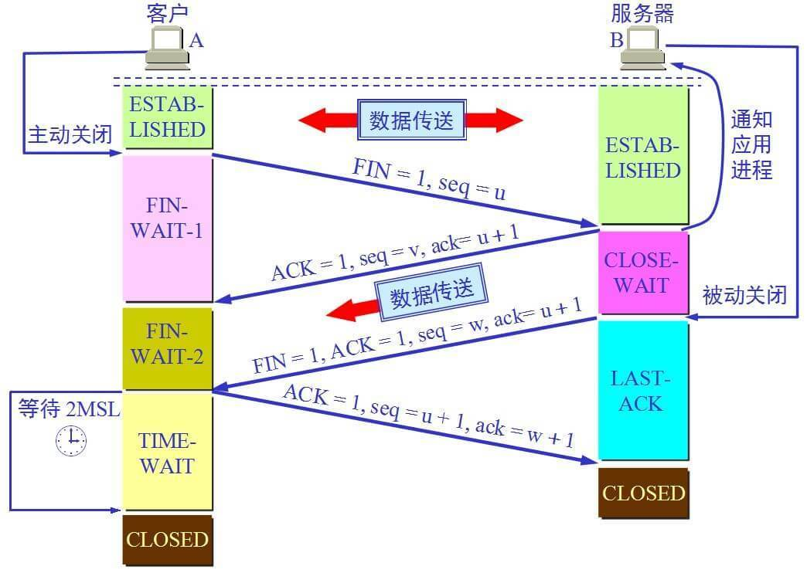
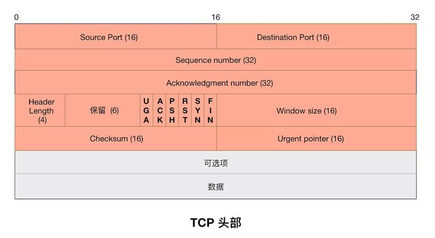

# Java基础概念

## Java中关键字final

- final 关键字可以用于成员变量、本地变量、方法以及类
- final 成员变量必须在声明的时候初始化或者在构造器中初始化，否则就汇报编译错误
- 不能够对 final 变量再次赋值
- 本地变量必须在声明时赋值
- 在匿名类中所有变量都必须是 final 变量
- final 方法不能被重写
- final 类不能被继承
- 接口中声明的所有变量本身是 final 的
- 没有在声明时初始化 final 变量的称为空白 final 变量(blank final variable)，它们必须在构造器中初始化，或者调用 this() 初始化，不这么做的话，编译器会报错final变量(变量名)需要进行初始化
- 按照 Java 代码惯例，final 变量就是常量，而且通常常量名要大写
- 对于引用类型变量，表示，当前引用不能被改变，但是引用里的值是可以改的
- final变量是只读

### final变量

final变量是只读

### final方法

final修饰方法，改方法不能被重写不能别重载，因为这个方法已经是定好的，不需要扩展

### final类

final修饰的类叫做final类。final类通常功能是完整的，不能被继承。

### 内存模型中 final

- 构造函数内，对一个final变量的写入，与随后把这个被构造对象的引用的引用赋值给一个变量，这两个操作之间不能被重排
- 首次读一个包含final变量的对象，与随后首次读这个final变量，这两个操作之间不可能重排序

### final 关键字的好处

- final 关键字提高了性能，JVM 和 Java 应用都会缓存 final 变量
- final 变量可以安全的在多线程环境下进行共享，而不需要额外的同步开销

## static关键字

### static存在的意义：

> 1、在于创建独立于具体对象的域变量或方法。**即使是没有创建对象，也能使用属性和方法。**
>
> 2、**用来形成静态代码块以优化程序性能，类初次加载的时候，先加载每个静态块，并且只执行一次。**

### static的特点：

> 1、被static修饰的变量或方法是独立于该类的任何对象，也就是说，这些变量和方法不属于任何一个实例对象，而是被类的实例对象所共享。
>
> **类的实例对象：**指的是当前类所派生出的所有类。
>
> 2、在该类被第一次加载的时候，就是加载被static修饰的部分，而且只在类第一次使用加载并初始化。
>
> 3、static变量值在类加载的时候分配空间，以后创建类对象的时候不会重新分配。
>
> 4、被static修饰的变量或方法是优先于对象存在的，也就是说一个类加载完毕之后，即使没有创建对象，也可以访问。

## 面向对象和面向过程的区别

### 面向过程：

优点：性能比面向对象高，因为类调用时需要实例化，开销比较大，比较消耗资源;比如单片机、嵌入式开发、Linux/Unix等一般采用面向过程开发，性能是最重要的因素。

缺点：没有面向对象易维护、易复用、易扩展

### 面向对象：

优点：易维护、易复用、易扩展，由于面向对象有封装、继承、多态性的特性，可以设计出低耦合的系统，使系统更加灵活、更加易于维护

缺点：性能比面向过程低


面向对象三大特定：

封装：

继承：

多态：

Java实现多态有三个必要条件：继承、重写、向上转型。

继承：在多态中必须存在有继承关系的子类和父类。

重写：子类对父类中某些方法进行重新定义，在调用这些方法时就会调用子类的方法。

向上转型：在多态中需要将子类的引用赋给父类对象，只有这样该引用才能够具备技能调用父类的方法和子类的方法。

只有满足了上述三个条件，我们才能够在同一个继承结构中使用统一的逻辑实现代码处理不同的对象，从而达到执行不同的行为。

### 匿名内部类：

- 匿名内部类必须继承一个抽象类或者实现一个接口。
- 匿名内部类不能定义任何静态成员和静态方法。
- 当所在的方法的形参需要被匿名内部类使用时，必须声明为 final。
- 匿名内部类不能是抽象的，它必须要实现继承的类或者实现的接口的所有抽象方法。

#### 内部类的优点

- 一个内部类对象可以访问创建它的外部类对象的内容，包括私有数据！
- 内部类不为同一包的其他类所见，具有很好的封装性；
- 内部类有效实现了“多重继承”，优化 java 单继承的缺陷。
- 匿名内部类可以很方便的**定义回调**。


#### 内部类应用场景

1. 一些多算法场合
2. 解决一些非面向对象的语句块。
3. 适当使用内部类，使得代码更加灵活和富有扩展性。
4. 当某个类除了它的外部类，不再被其他的类使用时。


## 重载和重写

重载：

> 方法名相同，参数列表不同，可以是不同类型，个数不同，顺序不同

重写：

> 一般发生在子类复写父类的方法实现，叫做重写，

### 构造器能否被重写？能否被重载？

> 构造器不能被继承，也不能被重写，但是可以重载

## 对象相等

### ==和equals

==：对于基础类型来说比较的是值，对于引用类型来说比较的是内存地址

equals：默认比较的是引用内存地址，一般重写equals来比较对象的类容是否相同

hashcode和equals

### HashCode和equals

- 如果两个对象相等，则hashcode一定也相等
- 两个对象相等，对他们得equals也一定相等
- 两个对象有相等得hashcode，但是他们不一定相等

**HashSet 如何检查重复**

HashSet 会先计算对象的 hashcode 值来判断对象加入的位置，同时也会与其他已经加入的对象的 hashcode 值作比较，如果没有相符的hashcode，HashSet会假设对象没有重复出现。但是如果发现有相同 hashcode 值的对象，这时会调用 equals()方法来检查 hashcode 相等的对象是否真的相同。如果两者相同，HashSet 就不会让其加入操作成功。如果不同的话，就会重新散列到其他位置。这样我们就大大减少了 equals 的次数，相应就大大提高了执行速度。


### 对象相等和引用相等区别：

对象相等：指的是内存中存放的内容是否相等

引用相等：指的是指向的内存地址是否相等

## 值传递

```java
 public static void main(String[] args) {
        int[] arr = new int[]{1, 2, 3};
        System.out.println(arr[0]);
        change(arr);
        System.out.println(Arrays.toString(arr));

        int num1 = 100;
        int num2 = 200;

        swap(num1, num2);
        System.out.println("num1 = " + num1);
        System.out.println("num2 = " + num2);
    }

    private static void swap(int num1, int num2) {
        int tmp = num1;
        num1 = num2;
        num2 = tmp;
        System.out.println("1 = " + num1);
        System.out.println("2 = " + num2);
    }


private static void change(int[] arr) {
        arr[0] = 100;
        System.out.println(Arrays.toString(arr));
}
```

```java
1
[100, 2, 3]
[100, 2, 3]
 
1 = 200
2 = 100
num1 = 100
num2 = 200
```

```java
public static void main(String[] args) {
    Student s1 = new Student("大哥");
    Student s2 = new Student("二哥");
    change(s1,s2);
    System.out.println("s1 = " + s1.name);
    System.out.println("s2 = " + s2.name);
}

private static void change(Student x, Student y) {
    x.name = "大哥大";
    y = new Student("二哥大");
    System.out.println("x = " + x.name);
    System.out.println("y = " + y.name);
}
```

```java
x = 大哥大
y = 二哥大
s1 = 大哥大
s2 = 二哥
```

解析：

> 对于基础类型而言，方法传递的是值得拷贝，方法内修改值不影响原来值
>
> 对于引用类型而已，方法传递得是引用得拷贝，方法内修改引用参数得值，也会修改传入之前引用的值，前提是不改变引用对象


总结：Java程序设计语言中总是采用按值调用，也就是说，方法得到的是所有参数的拷贝。

### 为什么 Java 中只有值传递

首先回顾一下在程序设计语言中有关将参数传递给方法（或函数）的一些专业术语。**按值调用(call by value)表示方法接收的是调用者提供的值，而按引用调用（call by reference)表示方法接收的是调用者提供的变量地址。**一个方法可以修改传递引用所对应的变量值，而不能修改传递值调用所对应的变量值。 它用来描述各种程序设计语言（不只是Java)中方法参数传递方式。


### 值传递和引用传递的区别？

值传递：指的是再方法调用时，传递得参数时按值得拷贝传递，传递得值得拷贝，也就是说传递之后就互不相关了

引用传递：指的是再方法调用时，传递得参数时按引用进行传递，其实传递得是引用得地址，也就是变量所对应得内存空间得地址。

### BIO,NIO,AIO 

BIO：Block IO 同步阻塞式 IO，就是我们平常使用的传统 IO，它的特点是模式简单使用方便，并发处理能力低。
NIO：Non IO 同步非阻塞 IO，是传统 IO 的升级，客户端和服务器端通过 Channel（通道）通讯，实现了多路复用。
AIO：Asynchronous IO 是 NIO 的升级，也叫 NIO2，实现了异步非堵塞 IO ，异步 IO 的操作基于事件和回调机制。

#### BIO (Blocking I/O)：

同步阻塞I/O模式，数据的读取写入必须阻塞在一个线程内等待其完成。在活动连接数不是特别高（小于单机1000）的情况下，这种模型是比较不错的，可以让每一个连接专注于自己的 I/O 并且编程模型简单，也不用过多考虑系统的过载、限流等问题。线程池本身就是一个天然的漏斗，可以缓冲一些系统处理不了的连接或请求。但是，当面对十万甚至百万级连接的时候，传统的 BIO 模型是无能为力的。因此，我们需要一种更高效的 I/O 处理模型来应对更高的并发量。

#### NIO (New I/O)：

NIO是一种同步非阻塞的I/O模型，在Java 1.4 中引入了NIO框架，对应 java.nio 包，提供了 Channel , Selector，Buffer等抽象。NIO中的N可以理解为Non-blocking，不单纯是New。它支持面向缓冲的，基于通道的I/O操作方法。 NIO提供了与传统BIO模型中的 Socket 和 ServerSocket 相对应的 SocketChannel 和 ServerSocketChannel 两种不同的套接字通道实现,两种通道都支持阻塞和非阻塞两种模式。阻塞模式使用就像传统中的支持一样，比较简单，但是性能和可靠性都不好；非阻塞模式正好与之相反。对于低负载、低并发的应用程序，可以使用同步阻塞I/O来提升开发速率和更好的维护性；对于高负载、高并发的（网络）应用，应使用 NIO 的非阻塞模式来开发

#### AIO (Asynchronous I/O)：

AIO 也就是 NIO 2。在 Java 7 中引入了 NIO 的改进版 NIO 2,它是异步非阻塞的IO模型。异步 IO 是基于事件和回调机制实现的，也就是应用操作之后会直接返回，不会堵塞在那里，当后台处理完成，操作系统会通知相应的线程进行后续的操作。AIO 是异步IO的缩写，虽然 NIO 在网络操作中，提供了非阻塞的方法，但是 NIO 的 IO 行为还是同步的。对于 NIO 来说，我们的业务线程是在 IO 操作准备好时，得到通知，接着就由这个线程自行进行 IO 操作，IO操作本身是同步的。查阅网上相关资料，我发现就目前来说 AIO 的应用还不是很广泛，Netty 之前也尝试使用过 AIO，不过又放弃了。

## 反射

### 什么是反射机制？

JAVA反射机制是在运行状态中，对于任意一个类，都能够知道这个类的所有属性和方法；对于任意一个对象，都能够调用它的任意一个方法和属性；这种动态获取的信息以及动态调用对象的方法的功能称为java语言的反射机制。

静态编译和动态编译

- **静态编译：**在编译时确定类型，绑定对象
- **动态编译：**运行时确定类型，绑定对象

### 反射机制优缺点

- **优点：** 运行期类型的判断，动态加载类，提高代码灵活度。
- **缺点：** 性能瓶颈：反射相当于一系列解释操作，通知 JVM 要做的事情，性能比直接的java代码要慢很多。

### 反射性能测试

```java
public static void main(String[] args) throws Exception {
    long s1 = System.currentTimeMillis();
    for (int i = 0; i < 1000000; i++) {
        Student s = new Student();
        s.doSomething("zhangsan " + i);

    }
    long e1 = System.currentTimeMillis();
    System.out.println(e1 - s1);
    long s2 = System.currentTimeMillis();
    for (int i = 0; i < 1000000; i++) {
        Class<?> clazz = Student.class;
        Object student = clazz.newInstance();
        Method method = clazz.getMethod("doSomething",String.class);
        method.invoke(student,"lisi" + i);

    }
    long e2 = System.currentTimeMillis();
    System.out.println("" + (e2 - s2));
}
```

```java
// 输出结果
52
209
```

总结：

> Because reflection involves types that **are dynamically resolved, certain Java virtual machine optimizations can not be performed.** Consequently, reflective operations have slower performance than their non-reflective counterparts, and should be avoided in sections of code which are called frequently in performance-sensitive applications.
>
> 为什么会慢：因为JVM的编译器，不能对反射相关的代码进行优化。

### 反射机制的应用场景有哪些

举例：

1、我们在使用JDBC连接数据库时使用Class.forName()通过反射加载数据库的驱动程序；

2、Spring框架也用到很多反射机制，最经典的就是xml的配置模式。Spring 通过 XML 配置模式装载 Bean 的过程：

	1) 将程序内所有 XML 或 Properties 配置文件加载入内存中; 
	1) Java类里面解析xml或properties里面的内容，得到对应实体类的字节码字符串以及相关的属性信息; 
	1) 使用反射机制，根据这个字符串获得某个类的Class实例; 
	1) 动态配置实例的属性

3、反射也可以跟注解配合使用，达到解析对应注解，完成相应的功能


## Java中Integer

```java
public static void main(String[] args) {
    Student s1 = new Student("大哥");
    Student s2 = new Student("二哥");
    change(s1,s2);
    System.out.println("s1 = " + s1.name);
    System.out.println("s2 = " + s2.name);

    Integer a = new Integer(3);
    Integer b = 3;
    int c  =3;
    System.out.println(a==b);	// false
    System.out.println(a==c);	// true
    System.out.println(b==c);	// true
    Integer a1 = 128;
    Integer a2 = 128;
    System.out.println(a1==a2);	// false

    Integer b1 = 127;
    Integer b2 = 127;
    System.out.println(b1==b2);	// true
}
```

**注意：**

>  如果整型字面量的值在-128到127之间，那么自动装箱时不会new新的Integer对象，而是直接引用常量池中的Integer对象，超过范围 a1==b1的结果是false。
>
>  因为Java的Integer类中有一个内部类，IntegerCache，将-128~127的值做了一个缓存，但是这个值能够被设置：
>
>  缓存在第一次使用时被初始化。缓存的大小可以由 {-XX:AutoBoxCacheMax=<size>} 选项控制。在VM初始化时，可以设置java.lang.Integer.IntegerCache.high属性并保存在sun.misc.VM类的私有系统属性中。

## Java中的异常

顶级父类Throwable，两个子类：Error，Exception

Exception

- 运行时异常
- 编译时异常


### JVM如何处理异常？

在一个方法中如果发生异常，这个方法会创建一个异常对象，并转交给 JVM，该异常对象包含异常名称，异常描述以及异常发生时应用程序的状态。创建异常对象并转交给 JVM 的过程称为抛出异常。可能有一系列的方法调用，最终才进入抛出异常的方法，这一系列方法调用的有序列表叫做调用栈。

JVM 会顺着调用栈去查找看是否有可以处理异常的代码，如果有，则调用异常处理代码。当 JVM 发现可以处理异常的代码时，会把发生的异常传递给它。如果 JVM 没有找到可以处理该异常的代码块，JVM 就会将该异常转交给默认的异常处理器（默认处理器为 JVM 的一部分），默认异常处理器打印出异常信息并终止应用程序

## Java中的泛型

### 泛型类和方法

```java
// 泛型类,和泛型方法的几种写法
public class Producer<T> {
    public T producer;

    /**
     * 对于类中泛型，是不能定义为static的
     * @return T
     */
    public T getProducer() {
        return producer;
    }

    public void setProducer(T producer) {
        this.producer = producer;
    }


    /**
     * 泛型方法
     * @param list
     * @param <E>
     * @return E
     */
    public <E> E getProducer(ArrayList<E> list){
        return list.get(getIdx(list.size()));
    }

    /**
     * 可变参数的静态方法
     * @param e
     * @param <E>
     * @return E
     */
    public static  <E> E getProducer(E... e){
        System.out.println(Arrays.toString(e));
        return e[getIdx(e.length)];
    }

    /**
     * 自定义多种类型泛型的打印
     * @param e
     * @param x
     * @param v
     * @param <E>
     * @param <X>
     * @param <V>
     */
    public static <E,X,V> void printType(E e,X x,V v) {
        System.out.println(e + "\t" + e.getClass().getSimpleName());
        System.out.println(x + "\t" + x.getClass().getSimpleName());
        System.out.println(v + "\t" + v.getClass().getSimpleName());
    }

    private static int getIdx(int size) {
        return new Random().nextInt(size);
    }
}
```

### 泛型接口:

```java
import java.lang.reflect.Method;

public class InfoImpl implements Info<Integer>{
    @Override
    public Integer info(Integer val) {
        return val;
    }

    public static void main(String[] args) {
        Class<InfoImpl> clazz = InfoImpl.class;
        Method[] methods = clazz.getDeclaredMethods();
        for (Method method : methods) {
            System.out.println(method.getName() + ":" + method.getReturnType().getSimpleName());
        }
    }
}
interface Info <T>{
    T info(T val);
}
//输出结果
main:void
info:Integer
info:Object
// 说明在泛型接口中,会多生成一个方法,这个方法就叫做桥接方法.
```

### 泛型数组

1. 可以声明带泛型的数组引用,但是不能直接创建带泛型的数组对象
2. 可以通过java.lang.reflect.Array 提供的newInstance(Class<T> clz, int length)方法创建T[]数组

```java
// 创建clz,类型的泛型数组
public T[] arr = (T[]) Array.newInstance(String.class,100);
```

### 为什么引入泛型?

类型安全:

1. 泛型得主要目的是提高Java程序的类型安全
2. 编译时期就既可以检查出因Java类型不正确导致的ClassCastException

消除强制类型转化:

1. 泛型一个好处是,使用直接得到目标类型,消除许多强制类型转换
2. 所得及所需,这使得代码更加可读,并且减少出错的机会

**注意:使用泛型,并不会影响性能**

> **泛型仅仅是java的语法糖，它不会影响java虚拟机生成的汇编代码，在编译阶段，虚拟机就会把泛型的类型擦除，还原成没有泛型的代码，所以网上说java用泛型比不用泛型速度慢7倍纯属无稽之谈，顶多编译速度稍微慢一些，执行速度是完全没有什么区别的.**

### 泛型的优势:

> Java中的泛型使得程序或者代码的**可读性**和**安全性**提高，这是它的最大优势。

### 类型擦除

> 无论你何时定义了一个泛型类型,都自动提供一个相应的原始类型,原始类型的类名称就是带有泛型的类删除泛型之后的类型名称,而原始类型会擦除类型变量,并且把他们替换为限定类型(如果没有指定限定类型,则擦除为Object类型)

### 为什么需要类型擦除

> **由于JVM引用泛型这个功能的代价是十分巨大的,所以Java没有在虚拟机层面引入泛型. 但是Java为了使用泛型,所以引入了类型擦除机制.**

> Java为了使用泛型，于是使用了类型擦除的机制引入了"泛型的使用"，并没有真正意义上引入和实现泛型。Java中的泛型实现的是编译期的类型安全，也就是泛型的类型安全检查是在编译期由编译器(常见的是javac)实现的，这样就能够确保数据基于类型上的安全性并且避免了强制类型转换的麻烦(实际上，强制类型转换是由编译器完成了，只是不需要人为去完成而已)。**一旦编译完成，所有的泛型类型都会被擦除，如果没有指定上限，就会擦除为Object类型，否则擦除为上限类型。**

> 既然Java虚拟机中不存在泛型，那么为什么可以从JDK中的一些类库获取泛型信息？这是因为类文件(.class)或者说字节码文件本身存储了泛型的信息，相关类库(可以是JDK的类库，也可以是第三方的类库)读取泛型信息的时候可以从字节码文件中提取，例如比较常用的字节码操作类库ASM就可以读取字节码中的信息甚至改造字节码动态生成类

### Java泛型通配符

```javascript
<?> 无限制通配符
<? extends E> extends 关键字声明了类型的上界，表示参数化的类型可能是所指定的类型，或者是此类型的子类
<? super E> super 关键字声明了类型的下界，表示参数化的类型可能是指定的类型，或者是此类型的父类
```

#### 上界配符<? extends T>

特性：

1. 上界通配符实例化的类必须是当前类，或是当前类的子类
2. 接收集合中的数据的数据类型只能是当前类，或是当前类的超类
3. 存数据时只能存入null

上界通配符：意思容器中存储数据类型的上限是T，存储数据时只能放当前类或当前类得子类，取数据得时候，并不能确定是当前类还是子类，所以只能用当前类或者父类接收获取得数据。在存入数据时，由于不确定实例化得类是当前类还是当前类得子类，所以无法存入，只能存入null。

#### 下界配符<? super T>

特性：

1. 下界通配符实例化的类必须时当前类，或时当前类的超类
2. 存储数据时数据类型只能是当前类，或是当前类的超类
3. 取数据时只能使用Object来接收

下界通配符：指的时是容器中存放类型的下限，既然是下限，则实例化时传入的对象只能时当前类或是当前类的超类，只能放T及其T的基类，取得时候，因为不知道具体是T还是其子类，所以只能使用Object来承载。

#### 上界和下界测试

```java
{
    public static class Animal {}

    public static class Cat extends Animal {}

    public static class BlackCat extends Cat {}

    public static class WhiteCat extends Cat {}

    public static void main(String[] args) {
        ArrayList<Animal> animals = new ArrayList<>();
        ArrayList<Cat> cats = new ArrayList<>();
        ArrayList<BlackCat> blackCats = new ArrayList<>();
        ArrayList<WhiteCat> whiteCats = new ArrayList<>();
//        cats.addAll(animals);   // 报错。参数类型上限是cat
//        upShow(animals);          // 报错。参数类型上限是cat
        cats.addAll(cats);
        cats.addAll(whiteCats);
        cats.addAll(blackCats);
        upShow(cats);
        upShow(blackCats);
        upShow(whiteCats);
        
        downShow(animals);
        downShow(cats);
//        downShow(blackCats);    // 报错，参数类型下限是cat
    }

    /**
     * 泛型上限通配符，要求传过来的集合类型，只能是Cat或Cat的子类类型。
     *
     * @param cats
     */
    private static void upShow(ArrayList<? extends Cat> cats) {
        // 报错，不能给定义上限通配符的集合添加任何元素(null除外)，即使是Cat类型
//        cats.add(new Animal());
//        cats.add(new Cat());
//        cats.add(new BlackCat());
        cats.forEach(System.out::println);
    }

    /**
     * 泛型下限通配符，要求传过来的集合元素，只能是Cat或Cat的父类类型。
     *
     * @param cats
     */
    private static void downShow(ArrayList<? super Cat> cats) {
//        cats.add(new Cat());    // 不报错，可以给cat添加自己，或子类
//        cats.add(new BlackCat());
//        cats.add(new WhiteCat());
        cats.forEach(System.out::println);
    }

}
```


总结：

1. 限定通配符总是包括自己
2. 对于集合上界类型通配符:add方法受限
3. 对于集合下界类型通配符:get方法受限
4. 如果想从一个数据类型里获取数据, 使用 ?extends通配符
5. 如果想把对象写入一个数据结构里,使用 ? super通配符

##### PECS原则

Effective Java书中介绍的PECS原则：

>  为了获得最大限度的灵活性，要在表示 生产者或者消费者 的输入参数上使用通配符，使用的规则就是：生产者有上限、消费者有下限：
>
> PECS:producer-extends,costumer-super


#### 无界通配符<?>

> 无解通配符意味着可以使用任何对象，因此使用它类似于使用原生类型，但是它是由作用的。原生来信可以持有任何类型，而无解通配符修饰的内容持有的是某种具体的类型。

### 上限和下限通配符总结：

#### 1、对于泛型方法来说

```java
// 上限通配符
// 泛型上限通配符，传递的集合类型，只能是Cat或Cat的子类类型。
private static void upShow(ArrayList<? extends Cat> cats) {}
// 下限通配符
// 泛型下限通配符，要求集合元素，只能是Cat或Cat的父类类型。
private static void downShow(ArrayList<? super Cat> cats){}
```

#### 2、对于泛型类来说

```java
// 只能使用extends，上限通配符，说明这个类中接收的对象只能是Cat类型，或者Cat的子类类型
public class Producer<T extends Cat> {}
// 注意：泛型类中不能使用super下限通配符。
```

#### 3、对于泛型集合来说

```java
// 上限通配符，指定集合类型，这个集合类型中不能添加任何类型的数据，除非null，取得时候可以准确得拿到类型是Cat
ArrayList<? extends Cat> eCat = new ArrayList<>();
Cat cat = eCat.get(0);
// 下限通配符，指定集合类型，这个集合类型中可以添加，Cat类型及其Cat的子类型，取数据的时候，因为不知道里面到底是Cat还是BlackCat，所以只能拿到Object。
ArrayList<? super Cat> sCat = new ArrayList<>();
sCat.add(new BlackCat());
sCat.add(new Cat());
sCat.add(new WhiteCat());
Object object = sCat.get(0);

//注意: 对于集合，既要取，又要存，那么就不要使用上限和下限通配符。
```

# 网络编程

## TCP/IP

### 三次握手：

通俗来讲：

1、客户端发起连接请求，服务端，接收到需要连接的请求

2、服务端收到了请求，回信告诉客户端，我的通信能力是可以的

3、客户端收到回复，回信告诉服务端，我的通信能力也是ok的，那么此时建立连接

> **第一次握手：**发起请求，客户端生成一个随机序列号，客户端向服务器发送报文中包含SYN标记位（例如：SYN = 1），序列号seq = x。
>
> **第二次握手：**服务端收到客户端请求，发现SYN=1，说明是连接请求，那么服务器将客户端发送来的seq存起来，并随机生成一个服务端自己的序列号，seq=y，并且回复客户端的报文，包含SYN，ACK标记，（SYN=1，ACK=1），序列号，seq = y，确认号，ack = x+1。
>
> **第三次握手：**客户端收到服务端回复后，发现ACK=1，并且ack=x+1，那么之傲服务器已经收到了自己的请求，同时发现，SYN=1，知道服务端同意了这次请求，于是将服务端seq保存起来，并回复服务端：包含，ack=y+1，seq=x+1，ACK标记位（ACK=1），当服务端收到这段信息，并解析里面的类容之后就会知道客户端收到了我的回复，并且客户端回复正确，那么就建立连接。

原理图：


### 四次分手：

通俗来讲：

不管是客户端，还是服务端，需要断开连接，都需要分别发送，标记位FIN=1的请求，那么说明我要断开连接了。

客户端和服务端，需要分别知道对方没有数据发送了，才能断开连接，只要有任何一方有数据就不能断开，故需要四次分手，分别告诉对方，我没有数据了，我要断开连接

> 第一次分手：客户端发送标记FIN=1，seq=x，的请求
>
> 第二次分手：服务端收到请求，知道客户端要断开连接了，回复ACK=1，seq=y，ack=x+1
>
> 第三次分手：并且服务端发送FIN=1，seq=w，ack=x+1，说明我同意你断开连接，并且我也要断开连接
>
> 第四次分手：客户端收到服务端的两次通知，第一次收到同意客户端断开的通知，第二次收到的是服务端也要断开连接的请求，那么此时客户端同意服务端断开连接的请求，就发送ACK=1，seq=x+1，ack=w+1的报文通知，并且客户端等待2MSL，就自己关闭连接。

原理图：



### 为什么要三次握手而是四次分手：

一言以蔽之：**我知道你不知道！**

### 为什么客户端发出第四次挥手的确认报文后要等2MSL的时间才能释放TCP连接？

因为：防止客户端还未发送通知到服务端就断开连接的情况。所以需要，因为是一次请求和回复的最大时长为2MSL

### 如果已经建立了连接，但是客户端突然出现故障了怎么办？

TCP设有一个保活计时器，务器每收到一次客户端的请求后都会重新复位这个计时器，时间通常是设置为**2小时**，若两小时还没有收到客户端的任何数据，服务器就会发送一个探测报文段，以后每隔75秒钟发送一次。若一连发送10个探测报文仍然没反应，服务器就认为客户端出了故障，接着就关闭连接。

### TCP/IP协议头：

#### 报文封装整体结构


#### mac帧头定义：

```c
/*数据帧定义，头14个字节，尾4个字节*/
typedef struct _MAC_FRAME_HEADER
{
 char m_cDstMacAddress[6];    // 目的mac地址
 char m_cSrcMacAddress[6];    // 源mac地址
 short m_cType;       　　　　　// 上一层协议类型，如0x0800代表上一层是IP协议，0x0806为arp
}__attribute__((packed))MAC_FRAME_HEADER,*PMAC_FRAME_HEADER;
```


#### IP头：

IP头：20个字节

```c
/*IP头定义，共20个字节*/
typedef struct _IP_HEADER 
{
 char m_cVersionAndHeaderLen;     　　//版本信息(前4位)，头长度(后4位)
 char m_cTypeOfService;      　　　　　 // 服务类型8位
 short m_sTotalLenOfPacket;    　　　　//数据包长度
 short m_sPacketID;      　　　　　　　 //数据包标识
 short m_sSliceinfo;      　　　　　　　  //分片使用
 char m_cTTL;        　　　　　　　　　　//存活时间
 char m_cTypeOfProtocol;    　　　　　 //协议类型
 short m_sCheckSum;      　　　　　　 	//校验和,做报文校验？
 unsigned int m_uiSourIp;     　　　　　//源ip
 unsigned int m_uiDestIp;     　　　　　//目的ip
} __attribute__((packed))IP_HEADER, *PIP_HEADER ;
```


- 版本（Version）字段：占4比特。用来表明IP协议实现的版本号，当前一般为IPv4，即0100。
- 报头长度（Header Length）字段：占4比特。是头部占32比特的数字，包括可选项。普通IP数据报（没有任何选项），该字段的值是5，即160比特=20字节。此字段最大值为60字节。
- 服务类型（Services Field）字段：占8比特。其中前3比特为优先权子字段（Precedence，现已被忽略）。第8比特保留未用。第4至第7比特分别代表延迟、吞吐量、可靠性和花费。当它们取值为1时分别代表要求最小时延、最大吞吐量、最高可靠性和最小费用。这4比特的服务类型中只能置其中1比特为1。可以全为0，若全为0则表示一般服务。服务类型字段声明了数据报被网络系统传输时可以被怎样处理。例如：TELNET协议可能要求有最小的延迟，FTP协议（数据）可能要求有最大吞吐量，SNMP协议可能要求有最高可靠性，NNTP（Network News Transfer Protocol，网络新闻传输协议）可能要求最小费用，而ICMP协议可能无特殊要求（4比特全为0）。实际上，大部分主机会忽略这个字段，但一些动态路由协议如OSPF（Open Shortest Path First Protocol）、IS-IS（Intermediate System to Intermediate System Protocol）可以根据这些字段的值进行路由决策。
- 总长度字段（Total Length）：占16比特。指明整个数据报的长度（以字节为单位）。最大长度为65535字节。
- 标识字段（Identification）：占16比特。用来唯一地标识主机发送的每一份数据报。通常每发一份报文，它的值会加1。
- 标志位字段（Flags）：占3比特。标志一份数据报是否要求分段。
- 段偏移字段（Fragment offset）：占13比特。如果一份数据报要求分段的话，此字段指明该段偏移距原始数据报开始的位置。
- 生存期（TTL：Time to Live）字段：占8比特。用来设置数据报最多可以经过的路由器数。由发送数据的源主机设置，通常为32、64、128等。每经过一个路由器，其值减1，直到0时该数据报被丢弃。
- 协议字段（Protocol）：占8比特。指明IP层所封装的上层协议类型，如ICMP（1）、IGMP（2） 、TCP（6）、UDP（17）等。
- 头部校验和字段（Header checksum）：占16比特。内容是根据IP头部计算得到的校验和码。计算方法是：**对头部中每个16比特进行二进制反码求和。**（和ICMP、IGMP、TCP、UDP不同，IP不对头部后的数据进行校验）。
- 源IP地址（source）、目标IP地址字段（destination）：各占32比特。用来标明发送IP数据报文的源主机地址和接收IP报文的目标主机地址。
- 可选项字段：占32比特。用来定义一些任选项：如记录路径、时间戳等。这些选项很少被使用，同时并不是所有主机和路由器都支持这些选项。可选项字段的长度必须是32比特的整数倍，如果不足，必须填充0以达到此长度要求。

#### TCP头：

TCP头：20个字节

```c
/*TCP头定义，共20个字节*/
typedef struct _TCP_HEADER 
{
 short m_sSourPort;        　　　　　　// 源端口号16bit
 short m_sDestPort;       　　　　　　 // 目的端口号16bit
 unsigned int m_uiSequNum;       　　// 序列号32bit
 unsigned int m_uiAcknowledgeNum;  // 确认号32bit
 short m_sHeaderLenAndFlag;      　　// 前4位：TCP头长度；中6位：保留；后6位：标志位
 short m_sWindowSize;       　　　　　// 窗口大小16bit
 short m_sCheckSum;        　　　　　 // 检验和16bit
 short m_surgentPointer;      　　　　 // 紧急数据偏移量16bit
}__attribute__((packed))TCP_HEADER, *PTCP_HEADER;
/*TCP头中的选项定义

kind(8bit)+Length(8bit，整个选项的长度，包含前两部分)+内容(如果有的话)

KIND = 
  1表示 无操作NOP，无后面的部分

  2表示 maximum segment   后面的LENGTH就是maximum segment选项的长度（以byte为单位，1+1+内容部分长度）

  3表示 windows scale     后面的LENGTH就是 windows scale选项的长度（以byte为单位，1+1+内容部分长度）

  4表示 SACK permitted    LENGTH为2，没有内容部分

  5表示这是一个SACK包     LENGTH为2，没有内容部分

  8表示时间戳，LENGTH为10，含8个字节的时间戳
*/
```



- 源、目标端口号字段：占16比特。TCP协议通过使用"端口"来标识源端和目标端的应用进程。端口号可以使用0到65535之间的任何数字。在收到服务请求时，操作系统动态地为客户端的应用程序分配端口号。在服务器端，每种服务在"众所周知的端口"（Well-Know Port）为用户提供服务。
- 顺序号字段：占32比特。用来标识从TCP源端向TCP目标端发送的数据字节流，它表示在这个报文段中的第一个数据字节。
- 确认号字段：占32比特。只有ACK标志为1时，确认号字段才有效。它包含目标端所期望收到源端的下一个数据字节。
- 头部长度字段：占4比特。给出头部占32比特的数目。没有任何选项字段的TCP头部长度为20字节；最多可以有60字节的TCP头部。
- 标志位字段（U、A、P、R、S、F）：占6比特。各比特的含义如下：
  - URG：紧急指针（urgent pointer）有效。
  - ACK：确认序号有效。
  - PSH：接收方应该尽快将这个报文段交给应用层。
  - RST：重建连接。
  - SYN：发起一个连接。
  - FIN：释放一个连接。
  - 窗口大小字段：占16比特。此字段用来进行流量控制。单位为字节数，这个值是本机期望一次接收的字节数。
  - TCP校验和字段：占16比特。对整个TCP报文段，即TCP头部和TCP数据进行校验和计算，并由目标端进行验证。
  - 紧急指针字段：占16比特。它是一个偏移量，和序号字段中的值相加表示紧急数据最后一个字节的序号。
  - 选项字段：占32比特。可能包括"窗口扩大因子"、"时间戳"等选项。

#### UDP：

```c
/*UDP头定义，共8个字节*/

typedef struct _UDP_HEADER 
{
 unsigned short m_usSourPort;    　　　// 源端口号16bit
 unsigned short m_usDestPort;    　　　// 目的端口号16bit
 unsigned short m_usLength;    　　　　// 数据包长度16bit
 unsigned short m_usCheckSum;    　　// 校验和16bit
}__attribute__((packed))UDP_HEADER, *PUDP_HEADER;
```

### Http1.1和Http2

### what's the deference with http1.1 and http2？

英文地址：https://www.digitalocean.com/community/tutorials/http-1-1-vs-http-2-what-s-the-difference

中文翻译：https://www.jianshu.com/p/63fe1bf5d445

### Http1.0：

> `HTTP 1.0` 浏览器与服务器只保持短暂的连接，每次请求都需要与服务器建立一个`TCP`连接
>
> 服务器完成请求处理后立即断开`TCP`连接，服务器不跟踪每个客户也不记录过去的请求
>
> 简单来讲，每次与服务器交互，都需要新开一个连接

#### 总结：

- 浏览器与服务器只保持短暂的连接，浏览器的每次请求都需要与服务器建立一个TCP连接

### Http1.1：

> 在`HTTP1.1`中，默认支持长连接（`Connection: keep-alive`），即在一个TCP连接上可以传送多个`HTTP`请求和响应，减少了建立和关闭连接的消耗和延迟
>
> 建立一次连接，多次请求均由这个连接完成

#### 总结：

- 引入了持久连接，即TCP连接默认不关闭，可以被多个请求复用

- 在同一个TCP连接里面，客户端可以同时发送多个请求

- 虽然允许复用TCP连接，但是同一个TCP连接里面，所有的数据通信是按次序进行的，服务器只有处理完一个请求，才会接着处理下一个请求。如果前面的处理特别慢，后面就会有许多请求排队等着

- 新增了一些请求方法

- 新增了一些请求头和响应头

  

### Http2.0：

#### 多路复用

> `HTTP/2` 复用`TCP`连接，在一个连接里，客户端和浏览器都可以**同时**发送多个请求或回应，而且不用按照顺序一一对应，这样就避免了”队头堵塞”

#### 二进制分帧

> 帧是`HTTP2`通信中最小单位信息
>
> `HTTP/2` 采用二进制格式传输数据，而非 `HTTP 1.x`的文本格式，解析起来更高效
>
> 将请求和响应数据分割为更小的帧，并且它们采用二进制编码
>
> `HTTP2`中，同域名下所有通信都在单个连接上完成，该连接可以承载任意数量的双向数据流
>
> 每个数据流都以消息的形式发送，而消息又由一个或多个帧组成。多个帧之间可以乱序发送，根据帧首部的流标识可以重新组装，这也是多路复用同时发送数据的实现条件

#### 首部压缩

> `HTTP/2`在客户端和服务器端使用“首部表”来跟踪和存储之前发送的键值对，对于相同的数据，不再通过每次请求和响应发送
>
> 首部表在`HTTP/2`的连接存续期内始终存在，由客户端和服务器共同渐进地更新
>
> 例如：下图中的两个请求， 请求一发送了所有的头部字段，第二个请求则只需要发送差异数据，这样可以减少冗余数据，降低开销

#### 服务器推送

> `HTTP2`引入服务器推送，允许服务端推送资源给客户端
>
> 服务器会顺便把一些客户端需要的资源一起推送到客户端，如在响应一个页面请求中，就可以随同页面的其它资源
>
> 免得客户端再次创建连接发送请求到服务器端获取
>
> 这种方式非常合适加载静态资源

#### 总结：

- 采用二进制格式而非文本格式
- 完全多路复用，而非有序并阻塞的、只需一个连接即可实现并行
- 使用报头压缩，降低开销
- 服务器推送

### DNS：

域名解析服务，将对应的域名解析成IP地址。

网络：食之无味，弃之可惜。

**如何防止DNS劫持？**

- 除了监视和分析之外，您还可以在DNS服务器上进行配置更改。

- 限制递归查询以防止潜在的有针对性的中毒攻击

- 仅存储与请求域相关的数据

- 限制响应以仅提供有关请求域的响应

- 强制客户端使用HTTPS

- 请确保您使用的是BIND和DNS软件的最新版本，以便您具有最新的安全修复程序。

#### DNS查询方式

DNS有两种查询方式:

- 递归查询：如果A请求B，那么B作为请求的接收者一定要给A想要的答案


- 迭代查询：如果接收者B没有请求者A所需要的准确内容，接收者B将告诉请求者A，如何去获得这个内容，但是并不去发送请求


#### 域名缓存

在域名服务器解析的时候，使用缓存保持域名和IP地址的映射

计算机中DNS的记录也分了两种缓存方式：

- 浏览器缓存：浏览器在获取网站域名的实际IP地址后会对其进行缓存，减少网络请求的损耗
- 操作系统缓存：操作系统的缓存其实是用用户自己配置的hosts文件


### CDN

CDN：content delivery network。内容分发网络。

**没有CDN：**

> 用户提交域名→浏览器对域名进行解释→`DNS` 解析得到目的主机的IP地址→根据IP地址访问发出请求→得到请求数据并回复

**有CDN：**

> 应用`CDN`后，`DNS` 返回的不再是 `IP` 地址，而是一个`CNAME`(Canonical Name ) 别名记录，指向`CDN`的全局负载均衡
>
> `CNAME`实际上在域名解析的过程中承担了中间人（或者说代理）的角色，这是`CDN`实现的关键

#### 负载均衡：

由于没有返回`IP`地址，于是本地`DNS`会向负载均衡系统再发送请求 ，则进入到`CDN`的全局负载均衡系统进行智能调度：

- 看用户的 IP 地址，查表得知地理位置，找相对最近的边缘节点
- 看用户所在的运营商网络，找相同网络的边缘节点
- 检查边缘节点的负载情况，找负载较轻的节点
- 其他，比如节点的“健康状况”、服务能力、带宽、响应时间等

结合上面的因素，得到最合适的边缘节点，然后把这个节点返回给用户，用户就能够就近访问`CDN`的缓存代理

#### 缓存代理：

缓存系统是 `CDN`的另一个关键组成部分，缓存系统会有选择地缓存那些最常用的那些资源

其中有两个衡量`CDN`服务质量的指标：

- 命中率：用户访问的资源恰好在缓存系统里，可以直接返回给用户，命中次数与所有访问次数之比
- 回源率：缓存里没有，必须用代理的方式回源站取，回源次数与所有访问次数之比

缓存系统也可以划分出层次，分成一级缓存节点和二级缓存节点。一级缓存配置高一些，直连源站，二级缓存配置低一些，直连用户

回源的时候二级缓存只找一级缓存，一级缓存没有才回源站，可以有效地减少真正的回源

现在的商业 `CDN`命中率都在 90% 以上，相当于把源站的服务能力放大了 10 倍以上

#### 总结

`CDN` 目的是为了改善互联网的服务质量，通俗一点说其实就是提高访问速度

`CDN` 构建了全国、全球级别的专网，让用户就近访问专网里的边缘节点，降低了传输延迟，实现了网站加速

通过`CDN`的负载均衡系统，智能调度边缘节点提供服务，相当于`CDN`服务的大脑，而缓存系统相当于`CDN`的心脏，缓存命中直接返回给用户，否则回源


### GET和POST的区别？

**解释：**

1、GET请求会将header和data数据一并发过去，也就是请求一次服务器

2、POST请求会先发送header请求一次服务器，服务器响应100 continue，浏览器再发送data。

3、有研究表明，再网络好的时候，发送一次请求和发送两次请求无差别，再网络差的时候，两次请求下场景下，包的完整性比较好。

4、不管是GET还是POST，他们在使用的时候不管是在URL还是在BODY中传输数据，都是可以的。

4、（大多数）浏览器通常都会限制url长度在2K个字节，而（大多数）服务器最多处理64K大小的url。超过的部分，恕不处理，如果使用GET服务，在body中偷偷藏了数据，不同的服务器处理的方式也不同，有些服务器会忽略GET中BODY体的内容。


**注意：**GET和POST在使用的时候是毫无差别的，都是TCP连接，但是在处理（包括服务端和客户端处理）的时候会有些许差别。

**GET和POST规范：**

1. GET与POST都有自己的语义，不能随便混用。

2. 据研究，在网络环境好的情况下，发一次包的时间和发两次包的时间差别基本可以无视。而在网络环境差的情况下，两次包的TCP在验证数据包完整性上，有非常大的优点。

3. 并不是所有浏览器都会在POST中发送两次包，Firefox就只发送一次。