# JVM

## 1、JVM基础知识

1.1、什么是Java？

1.2、常见的JVM

Java 从编码到执行过程

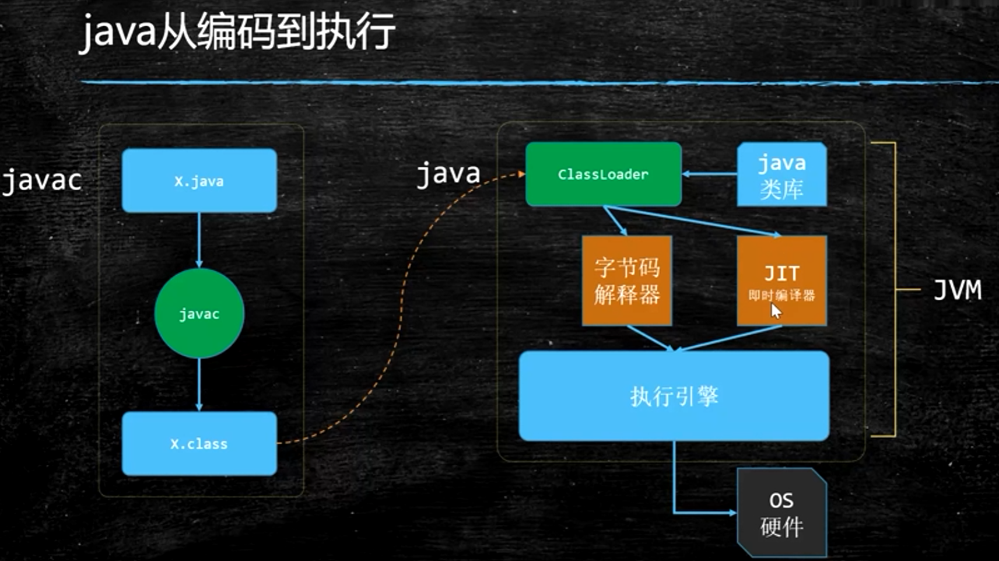

JDK JRE JVM

```txt
JDK = jre + development kit
JRE = jvm + core lib
JVM
```

## 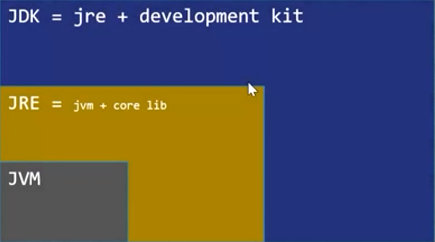2、ClassFileFormat

JVM中class文件格式

```JAVA
// JAVA 类
public class ByteCode {
}
```

ByteCode类`javac`之后的.class二进制文件如下：

```hex

```

字节码解释如下：


## 3、class加载过程

### 3.1、Loading

#### 3.1.1、类加载过程

原理图：

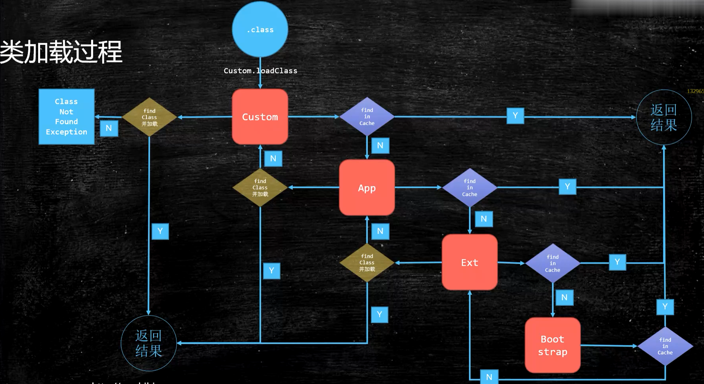

#### 3.1.2、双亲委派

- 父加载器：
  - 不是“类加载器的加载器”，也不是“类加载器的父类加载器”
- 双亲委派是一个孩子向父亲方向，然后父亲向孩子方向的双亲委派过程

思考：为什么要有双亲委派？

主要是安全考虑。

#### 3.1.3、自定义类加载器

- 继承ClassLoader
- 重写模板方法findClass
  - 调用defineClass
- 自定义类加载器自加密的class
  - 防止反编译
  - 防止篡改

#### 3.1.4、LazyLoading

懒加载的五种情况：

- new getstatic putstatic invokestatic指令，访问final变量除外
- java.lang.reflect对类进行反射调用时
- 初始化子类的时候，父类首先初始化
- 虚拟机启动时，被执行的主类必须初始化
- 动态语言支持java.lang.invoke.MethodHandle解析的结果为REF_getstatic REF_putstatic REF_invokestatic的方法句柄时，该类必须初始化

#### 3.1.5、混合模式

- 解释器
  - bytecode interpreter
- JIT
  - Just In-Time compiler
- 混合模式
  - 混合使用解释器+热点代码编译
  - 起始阶段次啊用解释执行
  - 热点代码检测
    - 多次被调用的方法（方法计数器：检测方法执行频率）
    - 多次呗调用的循环（循环计数器 ：检测循环执行频率）
    - 进行编译
    - -Xmixed 默认混合模式，开始解释执行，启动速度较快，对热点代码实行检测喝编译
- -Xmixed 默认混合模式，开始解释执行，启动速度较快，对热点代码实行检测喝编译
- -Xint 使用解释模式，启动很快，执行稍慢
- -Xcomp 使用纯编译模式，执行很快，启动很慢
- 检测热点代码：-XX:CompileThreshold = 10000

#### 3.1.6、ClassLoader源码

#### 3.1.7、自定义类加载器

```java
public class CustomClass extends ClassLoader{

    @Override
    // 1、重写loadClass方法
    public Class<?> loadClass(String name) throws ClassNotFoundException {
        // 2、类路径
        File file = new File("E://workspace//source//java-base//target//classes//com//ouyangliuy",name.replace(".","/").concat(".class"));
       try {
           FileInputStream fis = new FileInputStream(file);
           ByteArrayOutputStream baos = new ByteArrayOutputStream();
           int b = 0;
           while ((b= fis.read()) != 0){
               baos.write(b);
           }
           byte[] bytes = baos.toByteArray();
           baos.close();
           fis.close();
           return defineClass(name,bytes,0,bytes.length);
       }catch (Exception e){
           e.printStackTrace();
       }
        return super.loadClass(name);
    }

    public static void main(String[] args) throws ClassNotFoundException, InstantiationException, IllegalAccessException, NoSuchMethodException, InvocationTargetException {
        ClassLoader customClass = new CustomClass();
        Class<?> aClass = customClass.loadClass("com.ouyangliuy.jvm.Hello");
        System.out.println(aClass);
        Hello hello = (Hello) aClass.getDeclaredConstructor().newInstance();
        hello.sayHello();
        System.out.println(customClass.getClass().getClassLoader());

    }
}

```

### 3.2、Linking

### 3.3、InitiaInlizing

### 3.4、总结

1. load过程 -> 默认值 -> 初始值
2. new过程 -> 申请内存 -> 默认值 -> 初始值

## 4、单例模式-双重检测

## 5、JMM

什么是JMM： JMM是Java定义的一套内存模型，定义了多线程环境下线程如何与内存交互，确保共享数据的一致性、可见性和有序性。保证共享属性的一致性等。

> JMM 规定了**Java线程之间如何共享变量**，以及**读写变量时的可见性和有序性保证**。

三大核心问题：


| 可见性 | 一个线程对变量的修改，何时对其他线程可见？（如`volatile`） |
| ------ | ---------------------------------------------------------- |


| 有序性 | 指令是否可以被重排序？JMM 保证什么顺序？（如`happens-before`） |
| ------ | -------------------------------------------------------------- |


| 原子性 | 一个操作是否不可分割？如`synchronized`块中的操作 |
| ------ | ------------------------------------------------ |

### 5.1、缓存一致性协议

协议有很多，inter使用MESI

MESI Cache

- cpu 每个cache line 标记四种状态
- 缓存锁实现之一。

有些无法被缓存的数据或者跨过多个缓存行的数据，依然必须使用总线锁

现代CPU的数据一致性实现=**缓存锁(MESI...)** + **总线锁**

### 5.2、缓存行

cpu读取缓存以 cache line 为基本单位，多数cpu是64位

**伪共享：**位于同一缓存行的两个不同数据，被两个不同CPU锁定。产生互相影响的伪共享问题。

使用缓存行，能够提升效率

### 5.3、乱序问题

CPU为了提高指令执行效率，会在一条指令执行过程中（比如去内存读数据（慢100倍）），去同时执行另一条指令，前提是，两条指令没有依赖关系。

https://www.cnblogs.com/liushaodong/p/4777308.html

写操作也可以进行合并

https://www.cnblogs.com/liushaodong/p/4777308.html

JUC/029_WriteCombining

乱序执行的证明：JVM/jmm/Disorder.java

原始参考：https://preshing.com/20120515/memory-reordering-caught-in-the-act/

### 5.4、如何保证特定情况下不乱序

硬件内存屏障（X86）

> sfenc：store | 在sfence指令前的写操作当必须在sfence指令后的写操作完成。
>
> lfence：load | 在lfence指令前的读操作当必须在lfence指令后的读操作完成。
>
> mfence：modify/mix | 在mfence指令前的读写操作当必须在mfence指令后的读操作前完成

> 原子指令，如x86上的 `lock...`指令是Full Barrier，执行时会锁住内存子系统来确保执行顺序，甚至跨过多个CPU。Software Locks 通常使用了内存屏障或原子指令来实现变量可见性和保证程序顺序。

JVM级别如何规范（JSR133）

> LoadLoad屏障：
>
> ```
> 对于这样的语句，Load1（读操作）；LoadLoad； Load2（读操作）
>
> 在load2及后续读取操作要读取的数据被访问前，保证Load1要读取的数据被读取完毕。
> ```
>
> StoreStore屏障：
>
> ```
> 对于这样的语句，Store1（写操作）；StoreStore；Store2（写操作）；
>
> 在Store2及后续写入操作执行前，保证Store1的写入操作对其他处理器可见。
> ```
>
> LoadStore屏障：
>
> ```
> 对于这样的语句，Load1（写操作）；LoadStore；Store2；
> 在Store2及后续写入操作被刷出前，保证Load1要读取的数据被读取完毕。
> ```
>
> StroreLoad屏障：
>
> ```
> 对于这样的语句，Store1；StoreLoad；Load2；
> 在load2及后续所有读取操作执行前，保证Store1的写入对所有处理器可见。
> ```
>
>


### 5.6、Happens-Before 原则

JMM通过该原则定义操作间的顺序关系，确保以下场景的有序性：

* **程序顺序规则**：单线程内代码按编写顺序执行。
* **锁规则**：解锁操作先于后续加锁操作。
* **volatile规则**：写操作先于后续读操作。
* **传递性**：若A先于B，B先于C，则A先于C。

## 6、volatile实现细节

1、字节码层面

给属性添加 ACC_VOLATILE

2、JVM层面

volatile内存区的读写都加屏障

> StoreStoreBarrier
>
> volatile 写操作
>
> StoreLoadBarrier

```
解释：
在volatile 写之前加StoreStore屏障，保证其他的写操作在当前写操作完成之前完成
在volatile 写之后加StoreLoad屏障，保证当前写操作在其他写读操作之前完成
```

> LoadLoadBarrier
>
> volatile 读操作
>
> LoadStoreBarrier

```
解释：
在volatile 读之前加LoadLoad屏障，保证其他的读操作在当前读操作完成之前完成
在volatile 读之后加LoadStore屏障，保证当前读操作在其他读操作之前完成
```

3、OS和硬件层面

### [Java中volatile关键字实现原理](https://www.cnblogs.com/xrq730/p/7048693.html)

https://www.cnblogs.com/xrq730/p/7048693.html

```
hsdis - HotSpot Dis Assember
```


```
windows 使用lock指令实现 | MESI实现
```


## 7、对象的创建过程

## 8、对象内存的布局

一线互联网企业面试题：

> 1. 请解释一下对象的创建过程？
> 2. 对象在内存的存储布局
>    - JavaAgent_AboutObject.md
> 3. 对象头具体包括什么？
> 4. 对象怎么定位？
> 5. 对象怎么分配？
>    - GC相关内容
> 6. Object o = new Object 在内存中占用多少字节

### 8.1、对象的创建过程

1. class loading 加载到内存
2. class linking （verification，preparation，resolution）
   1. verification 验证
   2. preparation 准备  -> **类的静态变量赋默认值**
   3. resolution 解析
3. class initializing
   1. 静态变量设置初始值
   2. 同时执行静态语句块
4. 申请对象内存
5. 成员变量赋默认值
6. 调用构造方法<init>
   1. 成员变量顺序赋初始值
   2. 执行构造方法语句->调用父类super

### 8.2、使用JavaAgent测试Object的大小

当前系统64位

#### 8.2.1、观察虚拟机配置

```sh
java -XX:+PrintCommandLineFlags -version
```

#### 8.2.2、普通对象

1. 对象头：markword 8字节
2. ClassPointer指针：-XX:+UseCompressedClassPointers 为4字节（开启指针压缩），不开启为8字节
3. 实例数据

   **引用类型**：-XX:+UseCompressedOops（开启oop压缩）为4字节，不开启为8字节

   **oops**：Ordinary Object Pointers
4. Padding对象，8的倍数

#### 8.3.3、数组对象

1. 对象头：markword 8
2. ClassPointer指针同上
3. 数组长度：4字节
4. 数组数据
5. 对齐 8的倍数（对象大小必须是8的倍数）

总结：**数据对象比普通对象多了数组长度**

### 8.4、实验

1. 新建项目ObjectSize （1.8）
2. 创建文件ObjectSizeAgent

   ```java
   package com.mashibing.jvm.agent;

   import java.lang.instrument.Instrumentation;

   public class ObjectSizeAgent {
       private static Instrumentation inst;

       public static void premain(String agentArgs, Instrumentation _inst) {
           inst = _inst;
       }

       public static long sizeOf(Object o) {
           return inst.getObjectSize(o);
       }
   }
   ```
3. src目录下创建META-INF/MANIFEST.MF

   ```java
   Manifest-Version: 1.0
   Created-By: mashibing.com
   Premain-Class: com.mashibing.jvm.agent.ObjectSizeAgent
   ```

   注意Premain-Class这行必须是新的一行（回车 + 换行），确认idea不能有任何错误提示
4. 打包jar文件
5. 在需要使用该Agent Jar的项目中引入该Jar包
   project structure - project settings - library 添加该jar包
6. 运行时需要该Agent Jar的类，加入参数：

   ```java
   -javaagent:C:/work/ijprojects/ObjectSize/out/artifacts/ObjectSize_jar/ObjectSize.jar
   ```
7. 如何使用该类：

   ```java

      package com.mashibing.jvm.c3_jmm;

      import com.mashibing.jvm.agent.ObjectSizeAgent;

      public class T03_SizeOfAnObject {
          public static void main(String[] args) {
              System.out.println(ObjectSizeAgent.sizeOf(new Object()));
              System.out.println(ObjectSizeAgent.sizeOf(new int[] {}));
              System.out.println(ObjectSizeAgent.sizeOf(new P()));
          }

          private static class P {
                              //8 _markword
                              //4 _oop指针
              int id;         //4
              String name;    //4
              int age;        //4

              byte b1;        //1
              byte b2;        //1

              Object o;       //4
              byte b3;        //1

          }
      }
   ```

### 8.5、Hotspot开启内存压缩的规则（64位机）

1. 4G以下，直接砍掉高32位
2. 4G - 32G，默认开启内存压缩 ClassPointers Oops
3. 32G，压缩无效，使用64位
   内存并不是越大越好（^-^）

### 8.6、对象定位

1. 句柄池方式

   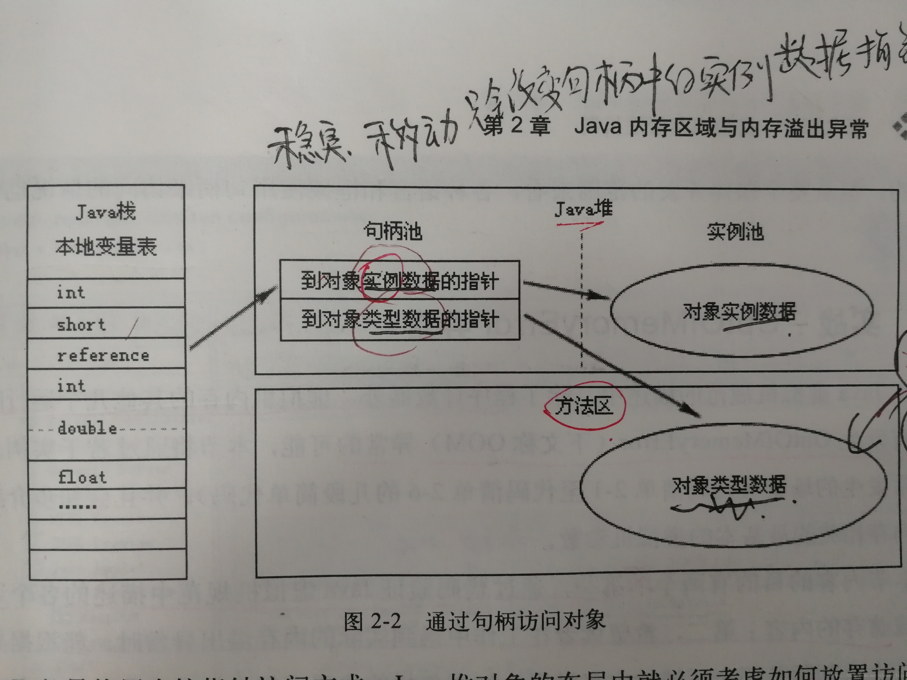
2. 直接指针方式

   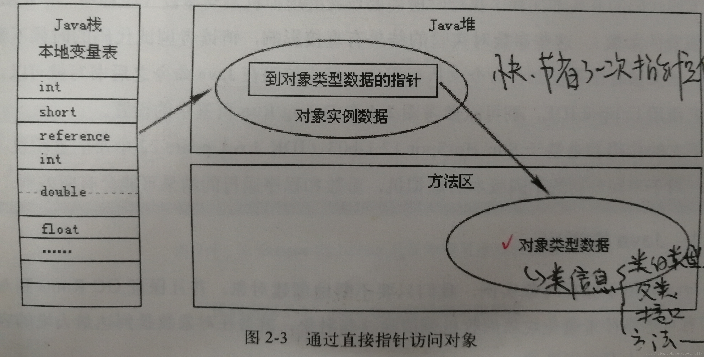

就**HotSpot**而言，他使用的是**直接指针访问方式**进行对象访问，但从整个软件开发的范围来看，各种语言和框架使用句柄来访问的情况也十分常见。

https://blog.csdn.net/clover_lily/article/details/80095580

## 9、JVM Runtime Data Area

```java
public class Test{
	public static void main(String[] args){
		int i = 8;
		i = i++;	// 1
		//i = ++i;	// 2
		System.out.println(i);
	}
    // 结果1：i为8
    // 结果2：i为9
}
```

### 9.1、PC

- Each Java Virtual Machine thread has its own pc(program counter) register.
- At any point, each Java Virtual Machine thread is executing the code of a single method,namely the current method for that thread.
- If that method is not native, the pc register contains the address of the Java Virtual Machine instruction currently being executed.

> 存放指令位置，
>
> 虚拟机的运行，类似这样的循环：
>
> while(not end){
>
> ```
> 取PC中的位置，找到对应位置的指令；
> ```
>
>
> ```
> 执行该指令；
> ```
>
>
> ```
> PC++;
> ```
>
>
> }

### 9.2、Jvm Stacks

- Each Java Virtual Machine thread has a private Java Virtual Machine stack,created at the same time as the thread.
- A Java Virtual Machine stack stores frames.

#### 9.2.1、Frame 栈帧

注意：**每个方法对应一个栈帧**

- A frame is used to store data and partila results , as well as to perform dynamic linking,return values for methods,and dispatch exceptions.

1. Local Variable Table 局部变量表
2. Operand Stack

   - <clinit> : 执行静态语句块
   - <init> ：执行构造器
   - _store：弹栈
   - _load：压栈
   - invoke_XXX：

   字节码层面

   存在返回值：

   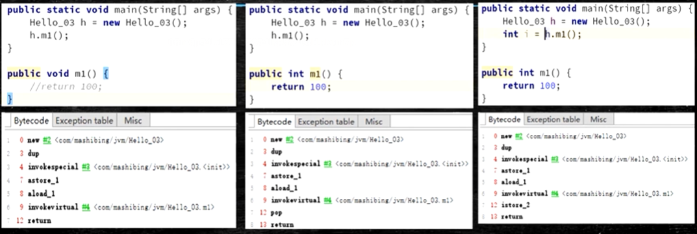

   递归调用：

   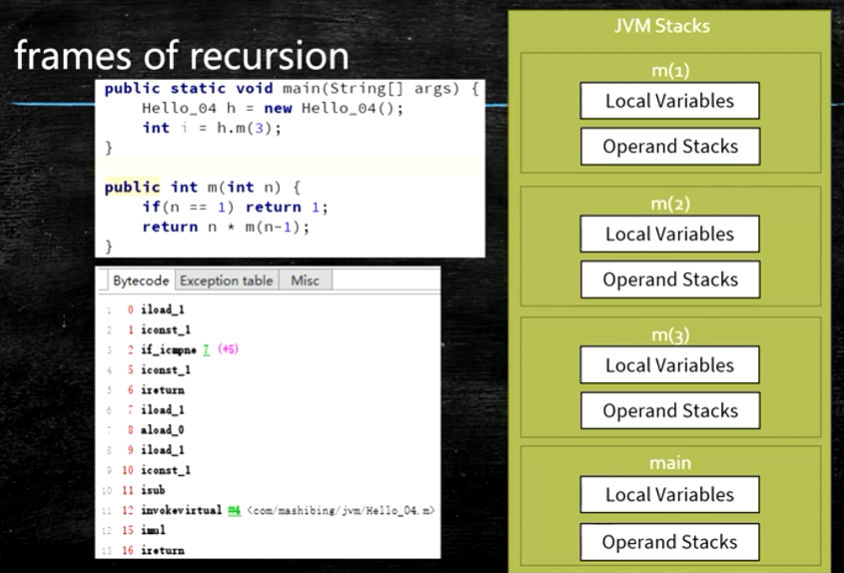
3. Dynamic Linking
4. return address

   a() ->b()，方法a调用了方法b，b方法的返回值放在什么地方？

**非static方法的局部变量表中默认第一位置存this**

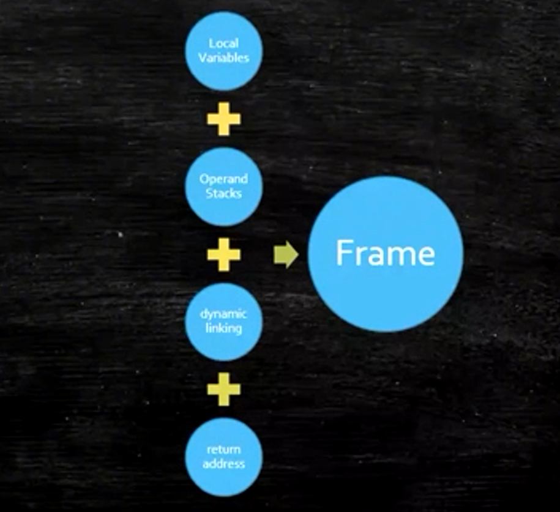

### 9.3、Heap

- The Java Virtual Machine has a heap that is shared among all Java Virtual Machine threads.
- The heap is the run-time data area from which memory for all class instances and arrays is allocated.

### 9.4、Method Area

- The Java Virtual Machine has a method area that is shared among all Java Virtual Machine threads.
- It stores per-class structures.

1. Perm Space ( 小于1.8版本)
   - 字符串常量位于PermSpace
   - FGC不会清理
   - 大小启动的时候指定，不能变
2. Meta Space(大于1.8版本)
   - 字符串常量位于堆
   - 会触发FGC清理
   - 不设定的话，最大就是物理内存

### 9.5、Run-Time Constant Pool

- A run-time constant pool is a per-class or per-interface run-time representation of the constant_pool table in a class file.

线程共享区域：

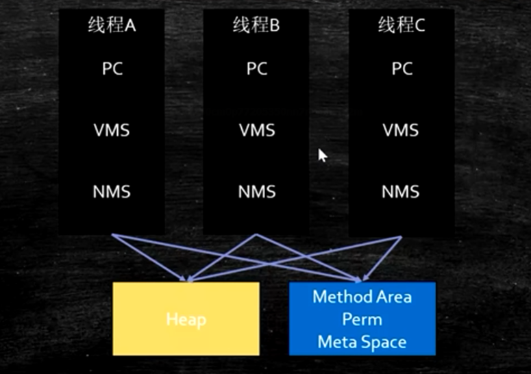

**补充：**

- 基于栈的指令集 -》 JVM实现 -> 实现简单，速度慢
- 基于寄存器的指令集 -》 汇编实现 -> 实现复杂，速度快

  Hotspot中的Local Variable Table = JVM中的寄存器

### 9.6、Direct Memory

> JVM 可以直接访问的内核空间的内存（OS管理的内存）
>
> NIO，使用的就是这部分内存，提高效率，实现zero copy

思考：

> 如何证明1.7字符串常量位于Perm，而1.8位于Heap？
>
> 提示：结合GC， 一直创建字符串常量，观察堆，和Metaspace，看提示的报错信息。

## 10、 Jvm Instructions

store

load

pop

invoke:

1. InvokeStatic
2. InvokeVirtual

   可以实现多态的方法
3. InvokeInterface
4. InovkeSpecial

   可以直接定位，不需要多态的方法

   例如：private方法，构造方法
5. InvokeDynamic

   Lamdba表达式、反射、其他动态语言scala kotlin，CGLib、ASM等动态产生的class，会用到此指令

## 11、JVM-GC

### 11.1、GC基础知识

> GC：Garbage Collectors

#### 11.1.1、什么是垃圾

- Java

  - GC 处理垃圾
  - 开发效率高，执行效率低
- C++

  - 手工处理垃圾
  - 忘记回收，导致内存泄漏
  - 回收多次，导致非法访问
  - 并发效率低，执行效率高
- C

  C语音申请内存：malloc，释放内存 free

**解释：**没有任何引用指向的一个对象或者多个对象（循环引用）

#### 11.1.2、怎么找到垃圾？

1、引用计数法（ReferenceCount）

当一个对象被引用对象数据为0，那么就当成垃圾

但是引用计数不能解决循环依赖引用问题

2、GC root，根可达算法（RootSearch）

GC roots包括 ：线程栈变量，静态变量，常量池，JNI指针等

> which instances are roots?
>
> JVM stack,native method stack, run-time constant pool, static references in method area, Clazz

#### 11.1.3、GC Algorithms

- Mark-Sweep（标记清除）
- Copying（拷贝）
- Mark-Compact（标记压缩）

##### 11.1.3.1、Mark-Sweep（标记清除）


**优点：**算法相对简单，存货对象比较多的情况下效率比较高

**缺点：**两边扫描，效率偏低，容易产生碎片

**执行过程：**第一遍扫描，找到不能回收的并标记，第二遍扫描，找到能回收的，进行回收

##### 11.1.3.2、Copying（拷贝）

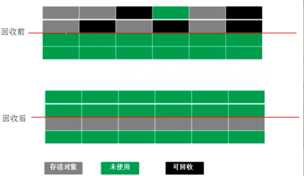

**优点：**算法容易理解，实现简单，只需要扫描一次，效率高，没有碎片

**缺点：**内存一分为二，空间浪费，移动复制对象，需要调整对象的引用

**执行过程：**第一次扫描内存中对象，将存活对象直接依次拷贝到另外一半内存中即可

**适合eden区域**

##### 11.1.3.3、Mark-Compact（标记压缩）

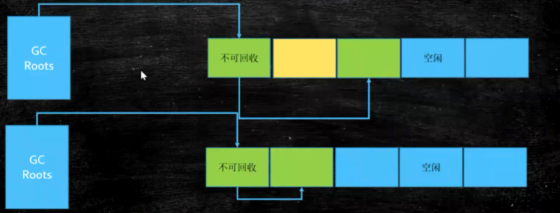

**优点：**不会产生内存碎片，方便对象分配，不会产生内存减半

**缺点：**移动对象，需要调整对象的引用，效率偏低

**执行过程：**第一次扫描，标记内存中对象，将对象移动到一个块整体的地方

##### 11.1.3.4、内存回收算法总结

1. 标记清除(mark sweep) - 位置不连续 产生碎片 效率偏低（两遍扫描）
2. 拷贝算法 (copying) - 没有碎片，浪费空间
3. 标记压缩(mark compact) - 没有碎片，效率偏低（两遍扫描，指针需要调整）

#### 11.1.4、JVM内存分代模型

1. 部门垃圾回收器使用的模型概括

   > 除了Epsilon、ZGC、Shenandoah之外的GC都是使用逻辑分代模型
   >
   > G1是逻辑分代，物理不分代
   >
   > 除此之外不仅逻辑分代，而且物理分代
   >
2. 新生代+老年代+永久代（1.7）Perm Generation / 元数据区（1.8） Metaspace

   > 1. 永久代 元数据 - Class
   > 2. 永久代必须指定大小限制，元数据可以设置，也可以不设置，无上限（受限于物理内存）
   > 3. 字符串常量 1.7 位于 永久代，1.8位于堆中
   > 4. MethodArea逻辑概念 - 永久代、元数据
   >

   <font color = red > 元数据区存放哪些数据</font>
3. 新生代=Eden+2个suvivor区

   > 1. YGC回收后，大多数的对象会被回收，活着进入s0
   > 2. 再次YGC，活着的对象eden+s0 -> s1
   > 3. 再次YGC，eden + s1 -> s0
   > 4. 年龄足够 -> (最大15，CMS：6)
   > 5. s区对象装不 直接进入到老年代
   >
4. 老年代

   > 从新生代进入到老年的对象，或者太大的对象直接进入老年代
   >
   > 老年代满了进行FGC，Full GC
   >
5. GC Tuning（Generation）

   > 1. 尽量减少FGC
   > 2. MinorGC = YGC
   > 3. MajorGC = FGC
   >
6. 动态年龄

   > 虚拟机并不是永远地要求对象的年龄必须达到了MaxTenuringThreshold才能晋升老年代，如果在Survivor空间中相同年龄所有对象大小的总和大于Survivor空间的一半，年龄大于或等于该年龄的对象就可以直接进入老年代，无须等到MaxTenuringThreshold中要求的年龄。
   >

   > 动态对象年龄判断，主要是被TargetSurvivorRatio这个参数来控制。而且算的是年龄从小到大的累加和，而不是某个年龄段对象的大小
   >
   > 参考链接：https://www.jianshu.com/p/989d3b06a49d
   >
7. 分配担保

   > YGC期间survivor区空间不够了，其他对象还想分配，空间担保直接进入老年代
   >
   > 参考：https://cloud.tencent.com/developer/article/1082730
   >

**分代模型图**

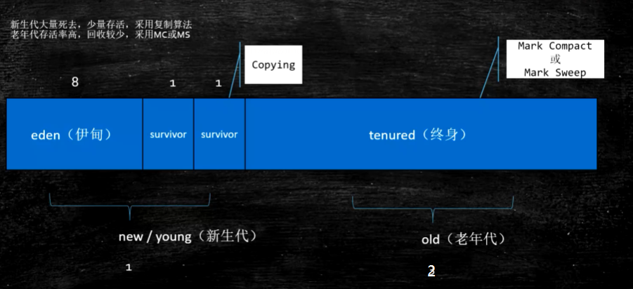

**GC概念**

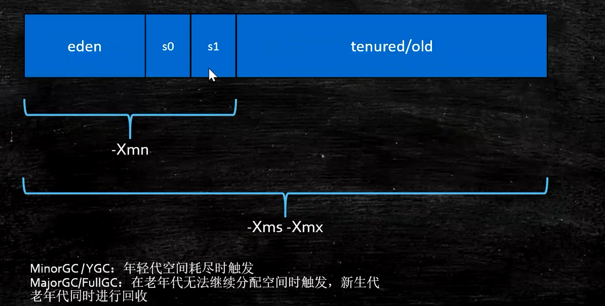

#### 11.1.5、对象从出生到消亡


> 1. 对象尝试在栈上分配
> 2. 到eden去分配
> 3. YGC，eden对象进入的S1
> 4. 继续YGC，S1进入到S2，GC年龄每次+1
> 5. 依次类推
> 6. 依次类推
> 7. 最终从S1或S2区进入到老年代

#### 11.1.6、栈上分配

- 栈上分配

  > 线程私有小对象
  >
  > 无逃逸
  >
  > 支持标量替换：一个对象中所具有的属性，可以用这些属性来代替，而不需要整个对象
  >
  > 优化：无需调整
  >
- 线程本地分配TLAB

  > JVM中每个线程都会分配一个TLAB
  >
  > Thread Local Allocation Buffer
  >
  > 占用eden区，默认是1%
  >
  > 多线程的时候不用竞争eden就可以申请空间，提高效率
  >
  > 针对的是小对象
  >
  > 优化：无需调整
  >
- 相关命令

  > -XX:-DoEscapeAnalysis 				逃逸分析
  >
  > -XX:-EliminateAllocations			 标量替换
  >
  > -XX:UseTLAB								   线程专有对象分配
  >
  > -Xlog:c5_gc*									日志
  >

#### 11.1.7、对象何时进入老年代

- 超过指定次数（YGC）
  - Parallel Scavenge：15
  - CMS ： 6
  - G1：15
- 动态年龄
  - s1 -> s2超过50%
  - 如果在Survivor空间中相同年龄所有对象大小的总和大于Survivor空间的一半，年龄大于或等于该年龄的对象就可以直接进入老年代

#### 11.1.8、对象创建到结束的过程

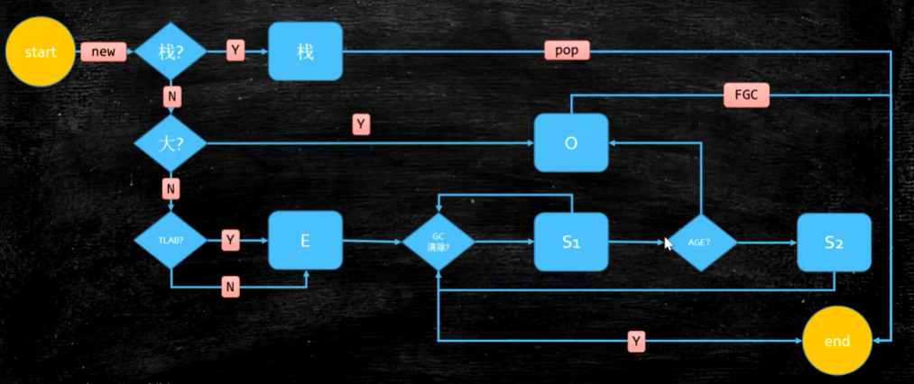

### 11.2、常见垃圾回收器

> **历史：**JDK诞生 Serial追随 提高效率，诞生了PS，为了配合CMS，诞生了PN，CMS是1.4版本后期引入，CMS是里程碑式的GC，它开启了并发回收的过程，但是CMS毛病较多，因此目前任何一个JDK版本默认是CMS。并发垃圾回收是因为无法忍受STW。

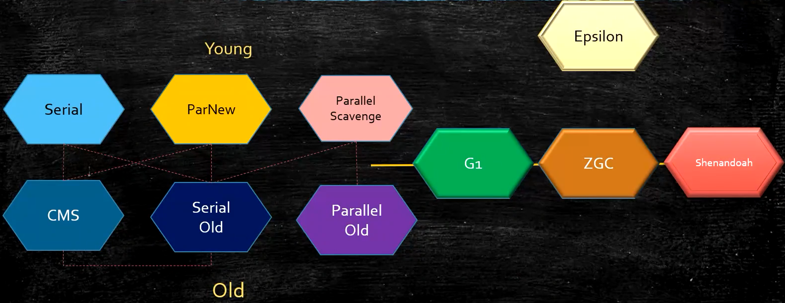

#### 11.2.1、Serial

> a stop-the-world , copying collector which uses a single GC thread.
>
> 单CPU效率高，年轻代 串行回收

#### 11.2.2、SerialOld

> a stop-the-world, mark-sweep-compact collector that uses a single GC thread.
>
> 老年代，使用标记整理算法，单线程回收

#### 11.2.3、Parallel Scavenge（PS）

> a stop-the-world, copying collector which uses multiple GC threads.
>
> 年轻代，配合PO的并行回收

#### 11.2.4、ParallelOld

> a compacting collector that uses multiple GC threads.
>
> 老轻代，并行回收

#### 11.2.5、ParNew

> a stop-the-world, copying collector which uses multiple GC threads.
>
> It differs from "Parallel Scavenge" in that it has enhancements that make it usable with CMS
>
> For example ,"ParNew" does the synchionization needed so that it can run during the concurrent phases of CMS.
>
> ParNew 是PS的增强
>
> 默认线程数为CPU核心数，在CMS运行的同时，PN会同时运行

#### 11.2.6、CMS

> CMS：ConcurrentMarkSweep
>
> a mostly concurrent , low-pasue collector.
>
> 4 phases ，4阶段
>
> 1. init mark 初始标记
> 2. concurrent mark 并发标记
> 3. remark 重新标记
> 4. concurrent  sweep 并发清理

CMS原理：

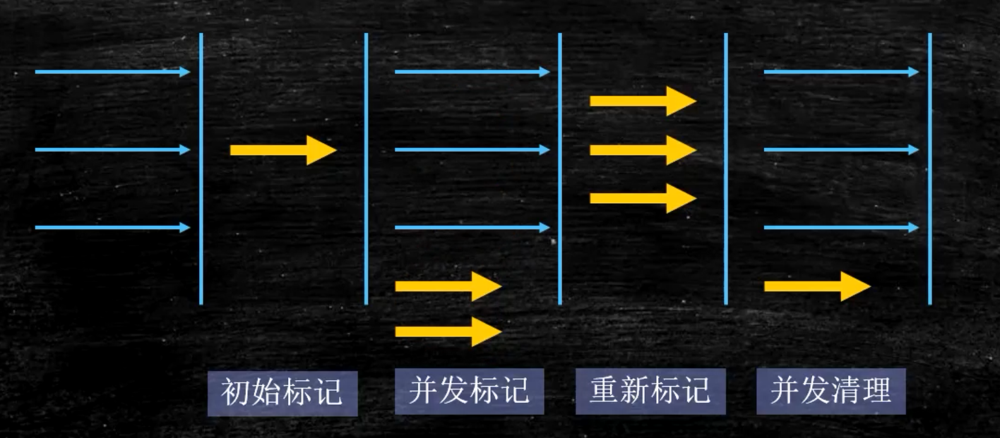

> 老年代，并发回收 ，垃圾回收和应用程序同时运行，降低STW的时间(200ms)
>
> CMS问题比较多，所以现在没有一个版本默认是CMS，只能手工指定
> CMS既然是MarkSweep，就一定会有碎片化的问题，碎片到达一定程度，CMS的老年代分配对象分配不下的时候，使用SerialOld 进行老年代回收

想象一下：

> PS + PO -> 加内存 换垃圾回收器 -> PN + CMS + SerialOld（几个小时 - 几天的STW）
> 几十个G的内存，单线程回收 -> G1 + FGC 几十个G -> 上T内存的服务器 ZGC

> 算法：三色标记 + Incremental Update

#### 11.2.7、G1(10ms)

> 算法：三色标记 + SATB

#### 11.2.8、ZGC (1ms) PK C++

> 算法：ColoredPointers + LoadBarrier

#### 11.2.9、Shenandoah

> 算法：ColoredPointers + WriterBarrier

#### 11.2.10、Eplison

#### 11.2.11、GC总结

1. GC常用组合

   > 1. Serial + Serial Old
   > 2. ParNew + CMS
   > 3. Parallel Scavenge + Parallel Old
   >
2. 年轻代老年代使用区别

   > 1. 年轻代中使用GC：Serial，ParNew，Parallel Scavenge
   > 2. 老年代中使用GC：CMS，Serial Old，Parallel Old
   >
3. ParNew VS PS

   > PN 响应时间优先
   >
   > PS 吞吐量优先
   >
   > 参考：https://docs.oracle.com/en/java/javase/13/gctuning/ergonomics.html
   >
4. 垃圾收集器跟内存大小的关系

   > 1. Serial 几十兆
   > 2. PS 上百兆 ~ 几个G
   > 3. CMS -> 20G
   > 4. G1 -> 上百G
   > 5. ZGC -> 4T - 16T(JDK13)
   >
5. 1.8默认的垃圾回收器

   > PS + ParallelOld
   >
6. 版本过程

   > 1.4 版本出现CMS，1.7出现G1，1.8比较完善的G1，1.9版本默认G1垃圾回收
   >

### 11.3、常见垃圾回收器组合参数设定

- -XX:+UseSerialGC = Serial New(DefNew) + Serial Old
- -XX:+UseParNewGC = ParNew + SerialOld

  这个组合已经很少用（在某些版本中已经废弃），

  参考：https://stackoverflow.com/questions/34962257/why-remove-support-for-parnewserialold-anddefnewcms-in-the-future
- -XX:+UseConcMarkSweepGC = ParNew +CMS +Serial Old

  有些版本下使用`-XX:+UseConcurrentMarkSweepGC`命令
- -XX:+UseParallelGC = Parallel Scavenge +Parallel Old（1.8默认）[PS+SerialOld]
- -XX:+UseParallelOldGC = Parallel Scavenge + Parallel Old
- -XX:+UseG1GC = G1

> Linux 中没有找到默认GCde查看方法，而windows中会打印UseParallelGC
>
> 命令：java +XX:+PrintCommandLineFlags -version
>
> 可以通过GC的日志来分辨
>
> Linux 下1.8版本默认的垃圾回收器是：PS + PO

### 11.4、JVM常用命令参数

- JVM命令行参数参考：https://docs.oracle.com/javase/8/docs/technotes/tools/unix/java.html
- Hotspot参数分类

  > 标准：-开头，所有的Hotspot支持，如：`java -c`等
  >
  > 非标准：-X开头，特定版本Hotspot支持特定命令
  >
  > 不稳定：-XX开头，下个版本可能取消
  >

实验程序：

```java
import java.util.List;
import java.util.LinkedList;

public class HelloGC {
  public static void main(String[] args) {
    System.out.println("HelloGC!");
    List list = new LinkedList();
    for(;;) {
      byte[] b = new byte[1024*1024];
      list.add(b);
    }
  }
}
```

1. 区分概念：内存泄漏memory leak，内存溢出 out of memory
2. java -XX:+PrintCommandLineFlags HelloGC
3. java -Xmn10M -Xms40M -Xmx60M -XX:+PrintCommandLineFlags -XX:+PrintGC  HelloGC
   PrintGCDetails PrintGCTimeStamps PrintGCCauses
4. java -XX:+UseConcMarkSweepGC -XX:+PrintCommandLineFlags HelloGC
5. java -XX:+PrintFlagsInitial 默认参数值
6. java -XX:+PrintFlagsFinal 最终参数值
7. java -XX:+PrintFlagsFinal | grep xxx 找到对应的参数
8. java -XX:+PrintFlagsFinal -version |grep GC

## 12、JVM 调优

### 12.1、调优前的基础概念

- 吞吐量：用户代码时间 / （用户代码执行时间+垃圾回收时间）
- 响应时间：STW越短，响应时间越好

> 所谓调优，首先确定，追求什么？吞吐量优先，还是响应时间优先？还是在满足一定响应时间的情况下，要求达到多大的吞吐量。

问题：

> 科学计算，吞吐量，数据挖掘，throughput。吞吐量优先一般：使用PS + PO的GC
>
> 响应时间：比如网站，GUI界面，API。使用（G1<1.8>）

### 12.2、什么是调优

1. 根据需求进行JVM规划和预调优
2. 优化运行JVM运行环境（慢，卡顿问题）
3. 解决JVM运行过程中出现的各种问题（OOM）

### 12.3、调优，从规划开始

- 调优，从业务场景开始，没有业务场景的调优都是耍流氓
- 无监控（压力测试，能看到结果），不调优
- 步骤：

  > 1、熟悉业务场景（没有最好的垃圾回收，只有最合适的垃圾回收器）
  >
  > - 响应时间、停顿时间（CMS，G1，ZGC）、只需给用户作响应
  > - 吞吐量 = 用户时间 /（用户时间 + GC时间）[PS]
  >
  > 2、选择回收器组合
  >
  > 3、计算内存需求（根据经验，压测）
  >
  > 4、选CPU（越高越好）
  >
  > 5、设定年大大小，升级年龄
  >
  > 6、设定日志参数
  >
  > - 设置5个文件，并循环利用
  >
  > ```sh
  > -Xloggc:/opt/xxx/logs/xxx-xxx-gc-%t.log		#设置日志文件地址
  > -XX:+UseGCLogFileRotation 		# 日志文件循环使用
  > -XX:NumberOfGCLogFiles=5 		# 日志文件数量 5个
  > -XX:GCLogFileSize=100M			# 每个日志文件大小 100M
  > -XX:+PrintGCDetails 			# 打印日志详情
  > -XX:+PrintGCDateStamps			# 打印日志时间详情
  > -XX:+PrintGCCause				# 打印日志原因
  > ```
  >
  > - 每天产生一个日志文件
  >
  > 7、观察日志情况
  >
- 案例：12306遭遇春节大规模抢票应该如何支撑？

  > 12306 应该是中国并发量最大的秒杀网站
  >
  > 号称并发量100W最高
  >
  > CDN -> LVS -> NGINX -> 业务系统 -> 每台机器1W并发（**10K问题**）100台机器
  >
  > 普通电商订单 -> 下单 -> 订单系统（IO） 减库存 -> 等待用户付款
  >
  > 12306的一种可能的模型：
  >
  > 下单 -> 减库存和订单（redis kafka）同时异步进行 -> 等待付款
  >
  > 如果最后减库存最后还会把压力压到一台服务器上：
  >
  > 那么可以做分布式本地库存 + 单独服务器做库存均衡，也就是说每个库存都只有一定量的数据，然后当出现库存数据不均衡情况，单独服务器来做均衡。
  >
  > 大流量的处理方法：**分而治之**
  >
- 怎么得到一个事务会消耗多少内存？

  1. 弄台机器，看能承受多少TPS？是不是达到目标？扩容或调优，让其达到
  2. 用压测来确定

### 12.4、优化环境

#### 12.4.1、面试问题1-经典

**典型问题1：**有一个50万PV的资料类网站（从磁盘提取文档到内存）原服务器32位，1.5G
的堆，用户反馈网站比较缓慢，因此公司决定升级，新的服务器为64位，16G
的堆内存，结果用户反馈卡顿十分严重，反而比以前效率更低了？

1. 为什么原网站慢?

   > 很多用户浏览数据，很多数据load到内存，内存不足，频繁GC，STW长，响应时间变慢
   >
2. 为什么会更卡顿？

   > 内存越大，FGC时间越长
   >
3. 咋办？

   > PS + PO -> PN + CMS 或者 G1
   >

#### 12.4.2、面试问题2-高频

典型问题2：系统CPU经常100%，如何调优？(面试高频)

> 分析：CPU100%那么一定有线程占用系统资源
>
> 1. 找出哪个进程CPU高（top命令）
> 2. 该进程中的哪个线程cpu高（top -Hp命令）
> 3. 导出该线程的堆栈（jstack）
> 4. 查找哪个方法（栈帧）消耗时间（jstack）
> 5. 工作线程占比高 | 垃圾回收线程占比高

#### 12.4.3、面试问题3-高频

典型问题3：系统内存飙高，如何查找问题？（面试高频）

> 1. 导出堆内存（jmap）
> 2. 分析（jhat，jvisualvm ，mat，jprofiler..)

如何监控JVM

> jstat jvisualvm jprofiler arthas top...

### 12.5、解决JVM运行中的问题

#### 12.5.1、从一个案例开始

```java
import java.math.BigDecimal;
import java.util.ArrayList;
import java.util.Date;
import java.util.List;
import java.util.concurrent.ScheduledThreadPoolExecutor;
import java.util.concurrent.ThreadPoolExecutor;
import java.util.concurrent.TimeUnit;

/**
 * 从数据库中读取信用数据，套用模型，并把结果进行记录和传输
 */

public class T15_FullGC_Problem01 {

    private static class CardInfo {
        BigDecimal price = new BigDecimal(0.0);
        String name = "张三";
        int age = 5;
        Date birthdate = new Date();
        public void m() {}
    }

    private static ScheduledThreadPoolExecutor executor = new ScheduledThreadPoolExecutor(50,
            new ThreadPoolExecutor.DiscardOldestPolicy());

    public static void main(String[] args) throws Exception {
        executor.setMaximumPoolSize(50);
        for (;;){
            modelFit();
            Thread.sleep(100);
        }
    }

    private static void modelFit(){
        List<CardInfo> taskList = getAllCardInfo();
        taskList.forEach(info -> {
            // do something
            executor.scheduleWithFixedDelay(() -> {
                //do sth with info
                info.m();
            }, 2, 3, TimeUnit.SECONDS);
        });
    }

    private static List<CardInfo> getAllCardInfo(){
        List<CardInfo> taskList = new ArrayList<>();
        for (int i = 0; i < 100; i++) {
            CardInfo ci = new CardInfo();
            taskList.add(ci);
        }
        return taskList;
    }
}

```

#### 12.5.2、解决问题步骤

1. 运行命令：java -Xms200M -Xmx200M -XX:+PrintGC  T15_FullGC_Problem01
2. top命令

   > top 可以观察到内存不断增长，CPU居高不下的进程
   >
   > top -Hp pid 观察进程中的线程，哪个线程CPU和内存占比高
   >
3. jps定位具体java进程
4. jstack

   > 定位线程状况，重点关注 WAITING BLOCKED
   >
   > 如：waiting on <0x0000000088ca3310> (a java.lang.Object)
   >
   > 假如有一个进程中100个线程，很多线程都在waiting on <0x00...> ，一定要找到是哪个线程持有这把锁
   > 怎么找？搜索jstack dump的信息，找<0x00...> ，看哪个线程持有这把锁RUNNABLE
   >
   > 这就是为什么阿里规范中，线程的名称（尤其是线程池）都要有意义的原因，
   >
   > 怎么定义线程池里的线程名称？（通过自定义ThreadFactory）
   >
5. jinfo pid
6. jstat -gc 动态观察gc情况

   > jstat -gc 4655 500 ：每个500个毫秒打印GC的情况
   >
   > **如果面试官问你是怎么定位OOM问题的？**如果你回答用图形界面（错误）
   > 1：已经上线的系统不用图形界面用什么？（cmdline arthas）
   > 2：图形界面到底用在什么地方？测试！测试的时候进行监控！（压测观察）
   >
7. jmap -histo 4655 | head -20，查找有多少对象产生
8. jmap -dump:format=b,file=xxx pid :

   > 线上系统，内存特别大，jmap执行期间会对进程产生很大影响，甚至卡顿（电商不适合）
   >
   > 1：设定了参数HeapDump，OOM的时候会自动产生堆转储文件
   >
   > 2：<font color='purpe'>很多服务器备份（高可用），停掉这台服务器对其他服务器不影响</font>
   >
   > 3：在线定位（一般小点儿公司用不到）
   >
9. java -Xms20M -Xmx20M -XX:+UseParallelGC -XX:+HeapDumpOnOutOfMemoryError T15_FullGC_Problem
10. 使用MAT/jhat/jvisualvm 进行dump文件分析

    > https://www.cnblogs.com/baihuitestsoftware/articles/6406271.html
    >
    > 命令：jhat -J-mx512M xxx.dump
    >
    > http://192.168.17.11:7000
    >
    > 也可以使用jvisualvm将dump文件导入再分析
    >
11. 定位问题，找到代码问题

#### 12.5.3、jconsole

1. 程序启动加参数

   > xxxxxxxxxx java -Djava.rmi.server.hostname=192.168.17.11 -Dcom.sun.management.jmxremote -Dcom.sun.management.jmxremote.port=11111 -Dcom.sun.management.jmxremote.authenticate=false -Dcom.sun.management.jmxremote.ssl=false XXX
   >
2. 果遭遇 Local host name unknown：XXX的错误，修改/etc/hosts文件，把XXX加入进去

   > 192.168.17.11 basic localhost localhost.localdomain localhost4 localhost4.localdomain4
   > ::1         localhost localhost.localdomain localhost6 localhost6.localdomain6
   >
3. 关闭linux防火墙（实战中应该打开对应端口）

   > service iptables stop
   > chkconfig iptables off #永久关闭
   >

#### 12.5.4、jvisualvm远程连接

> 简单做法：https://www.cnblogs.com/liugh/p/7620336.html

#### 12.5.5、jprofiler（收费）

#### 12.5.6、arthas在线排查工具

官方文档参考：https://arthas.aliyun.com/doc/quick-start.html

1. 为什么需要在线排查？

   > 在生产上我们经常会碰到一些不好排查的问题，例如线程安全问题，用最简单的threaddump或者heapdump不好查到问题原因。为了排查这些问题，有时我们会临时加一些日志，比如在一些关键的函数里打印出入参，然后重新打包发布，如果打了日志还是没找到问题，继续加日志，重新打包发布。对于上线流程复杂而且审核比较严的公司，从改代码到上线需要层层的流转，会大大影响问题排查的进度。
   >
2. jvm观察jvm信息
3. thread定位线程问题
4. dashboard 观察系统情况
5. heapdump + jhat分析
6. jad反编译

   > 1、动态代理生成类的问题定位
   >
   > 2、第三方的类（观察代码）
   >
   > 3、版本问题（确定自己最新提交的版本是不是被使用）
   >
7. redefine 热替换

   > 限制条件：只能改方法实现（方法已经运行完成），不能改方法名， 不能改属性及返回值
   >
   > https://arthas.aliyun.com/doc/redefine.html
   >
8. sc  - search class
9. watch  - watch method
10. 没有包含的功能：jmap

### 12.6、OOM案例

OOM产生的原因多种多样，有些程序未必产生OOM，不断FGC（CPU飙高，但内存回收特别少）

1. 硬件升级系统卡顿问题
2. 线程池不当运用产生OOM问题

   > 不断往List里加对象（太Low了）
   >
3. jira问题

   > 实际系统不断重启，
   >
   > 解决问题 加内存 + 更换垃圾回收器 G1
   >
   > 真正问题在哪儿？不知道
   >
4. **tomcat http-header-size过大问题**

   > tomcat请求头设置过大，导致并发请求，Http11ProctorOutputBuffer过大
   >
5. lamdba表达式导致方法区溢出问题（MethodArea / Perm Metaspce）

   > LambdaGC.java     -XX:MaxMetaspaceSize=9M -XX:+PrintGCDetails
   >

   ```java
   public class LambdaGC {
       public static void main(String[] args) {
           for(;;) {
               I i = C::n;
           }
       }

       public static interface I {
           void m();
       }

       public static class C {
           static void n() {
               System.out.println("hello");
           }
       }
   }

   Caused by: java.lang.OutOfMemoryError: Compressed class space
   	at sun.misc.Unsafe.defineClass(Native Method)
   	at sun.reflect.ClassDefiner.defineClass(ClassDefiner.java:63)
   	at sun.reflect.MethodAccessorGenerator$1.run(MethodAccessorGenerator.java:399)
   	at sun.reflect.MethodAccessorGenerator$1.run(MethodAccessorGenerator.java:394)
   	at java.security.AccessController.doPrivileged(Native Method)
   	at sun.reflect.MethodAccessorGenerator.generate(MethodAccessorGenerator.java:393)
   	at sun.reflect.MethodAccessorGenerator.generateSerializationConstructor(MethodAccessorGenerator.java:112)
   	at sun.reflect.ReflectionFactory.generateConstructor(ReflectionFactory.java:398)
   	at sun.reflect.ReflectionFactory.newConstructorForSerialization(ReflectionFactory.java:360)
   	at java.io.ObjectStreamClass.getSerializableConstructor(ObjectStreamClass.java:1574)
   ```
6. 直接内存溢出问题**（少见）**

   > 《深入理解Java虚拟机》P59，使用Unsafe分配直接内存，或者使用NIO的问题
   >
7. 栈溢出问题

   > 只能加大栈内存，-Xss设定太小
   >
8. 重写finalize引发频繁GC

   > 小米云，HBase同步系统，系统通过nginx访问超时报警，最后排查，C++程序员重写finalize引发频繁GC问题
   > 为什么C++程序员会重写finalize？（new delete）
   > finalize耗时比较长（200ms）
   >
9. 如果一个系统，内存一直消耗不超过10%，但是观察GC日志，发现FGC总是频繁发生，会是什么引起？

   > 只能是手动调用了 System.gc()函数
   >
10. Distuptor有个可以设置链的长度，如果过大，然后对象大，消费完不主动释放，会溢出
11. 用Jvm都会溢出，mycat用蹦过，1.6.5某个临时版本解析sql子查询算法有问题，9个exists的联合sql就导致生成几百万的对象
12. net大量线程，会产生native thread OOM，应该用线程池

    > 解决方案：减少堆空间，预留更多内存产生native thread
    >
    > jvm内存占用物理内存比例 50% ~ 80%
    >

## 13、GC算法

### 13.1、基本概念

card table：

> 由于做YGC时，很可能需要扫描整个Old区，效率非常低，所以JVM设计了CardTable，如果一个Old区CardTable中有对象指向Y区，就将它设为Dirty，下次扫描时，只需要扫描Dirty Card
>
> 在结构上，CardTable用BitMap来标记实现。

GC何时触发：

- YGC

  > Eden空间不足
  >
  > 多线程并行执行
  >
- FGC

  > Old空间不足
  >
  > System.gc()
  >

### 13.2、Garbage First（G1）

参考文档：https://www.oracle.com/technical-resources/articles/java/g1gc.html

> The [Garbage First Garbage Collector (G1 GC)](https://www.oracle.com/java/technologies/javase/hotspot-garbage-collection.html) is the low-pause, server-style generational garbage collector for Java HotSpot VM. The G1 GC uses concurrent and parallel phases to achieve its target pause time and to maintain good throughput. When G1 GC determines that a garbage collection is necessary, it collects the regions with the least live data first (garbage first).
>
> G1是一种服务端应用使用的垃圾收集器，目标是用在多核、大内存的机器上，它在大多数情况下可以实现指定GC暂停时间，同时还能保持比较高的吞吐量

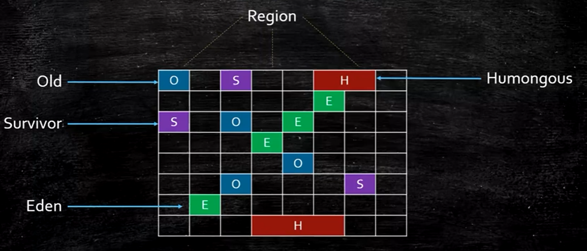

> 每个分区都可能是年轻代也可能是老年代，但是在同一时刻之鞥呢属于某个代。
>
> 年轻代、幸存区、老年代这些概念还存在，成为逻辑上的概率，这样方便复用之前分代框架的逻辑。在物理上不需要连续，则带来了额外的好处----有的分区内垃圾对象特别多，有的分区内垃圾对象很少，G1会优先回收垃圾对象特别多的区，这样可以花费较少的时间来回收这些分区的垃圾，这也就是G1名字的由来，即首先收集垃圾最多的分区。
>
> 新生代其实并不适用于这种算法的，依然是在新生代满了的时候，堆整个新生代进行回收----整个新生代中的对象，要么被回收，要么晋升，至于 新生代也采取分区机制的原因，则是因为这样跟老年代的策略统一，方便调整代的大小。
>
> G1还是一种带**压缩的收集器**，在回收老年代的分区时，时将存活的对象从一个分区拷贝到另一个可用分区，这个拷贝的过程就实现了局部的压缩。每个分区的大小从1M到32M不等，但都是2的幂次方。

**特点：**

- 并发收集 = CMS
- 压缩空闲空间不会延长GC的暂停时间
- 更容易预测的GC暂停时间
- 适用不需要实现很高的吞吐量的场景

**CSet**

> CSet  = Collection Set
>
> 一组可被回收的分区集合。
>
> 在Cset中存活的数据会在GC过程中被移动到另外一个可用分区，CSet中的分区可以来自Eden空间、survivor空间、及老年代。
>
> CSet会占用不到整个堆空间的1%大小

**RSet**

> RSet = RememberedSet
>
> 记录了其他Region中的对象到本Region的引用
>
> RSet的价值在于使得垃圾收集器不需要扫描整个堆找到谁引用了当前分区中对象，只需扫描RSet即可。

**RSet与赋值的效率**

> 由于RSet的存在，那么每次给对象赋引用的时候，就得做一些额外的操作
>
> 指的是RSet中做一些额外的记录（在GC中被称为写屏障）
>
> 这个写屏障不等于内存屏障。
>
> No Silver Bullet。没有银弹

**每个Region有多大**

> 在Hotspot的headpRegion.cpp
>
> 取值：1,2,4,8,16,32
>
> 手动指定：XX:G1HeapRegionSize

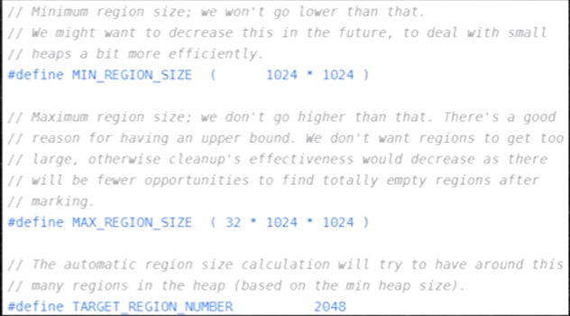

humongous object

超过单个region的50%

颜色指针：

> 简单理解：一个对象指针64bit，拿出指针上3个bit，来记录变是否换过，垃圾回收器扫描那些变过的指针回收

三色标记：

> 对象分3个颜色，

阿里的多租户JVM

> 每个租户单空间
>
> session based GC

G1中的MixedGC

> 相当于CMS
>
> XX:InitiatingHeapOccupacyPercent
>
> 默认值45%
>
> 当O超过这个值时，启动MixedGC

MixedGC执行过程

- 初始标记 STW
- 并发标记
- 最终标记STW（重新标记）
- 筛选回收STW（并行）

G1的FGC

> Java 10以前是串行FullGC，之后是并行FullGc

G1：调优关键，尽量不要有FGC

### 13.3、并发标记算法

CMS和G1中都使用

**难点：在标记过程中，对象应用在在发生改变**

**三色标记：**

> 对象在逻辑上被分为三种颜色：
>
> 白色：未被标记的对象
>
> 灰色：自身被标记，成员变量未被标记
>
> 黑色：自身和成员变量均已标记完成

**漏标：**

> 含义：本来是live objcet，但是由于没有遍历到，被当成garbage回收掉了
>
> 没有标记到就是垃圾。

> 在remark过程中，黑色指向了白色，如果不对黑色重新扫描，则会漏标，会把白色D对象当做没有新引用指向从而回收掉。
>
> 并发标记过程中，Mutator删除了从所有灰色到白色的引用，会产生漏标，此时白色对象被回收

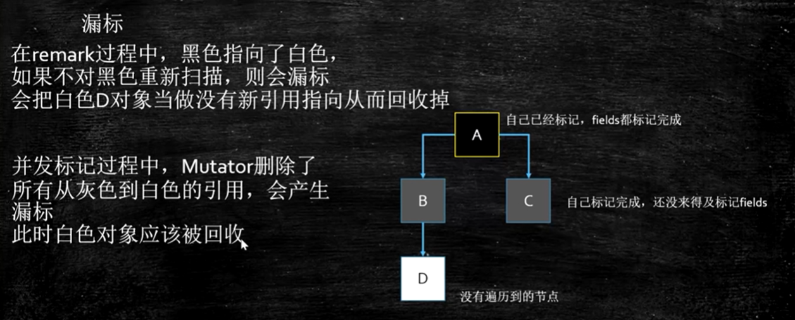

**产生漏标原因：**

1. 标记进行时增加了一个黑到白的引用，如果不重新对黑色进行处理，则会漏标
2. 标记进行时，删除了灰对象到白对象的引用，那么这个对象有可能被漏标

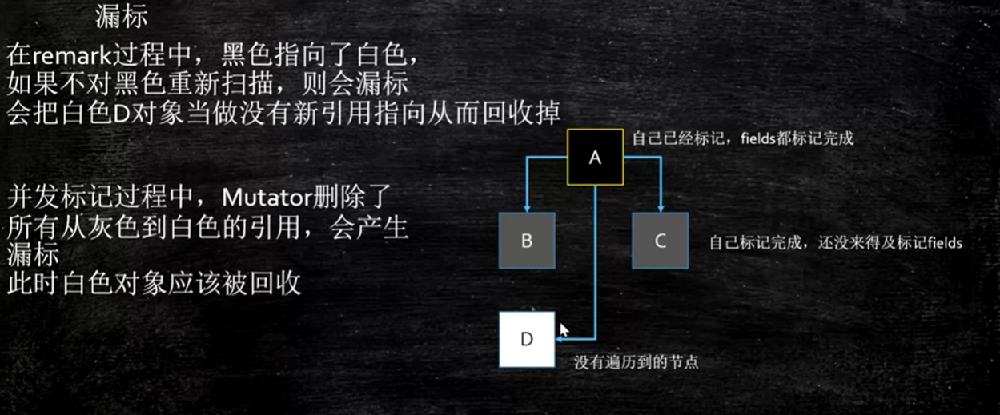

**解决漏标方法：**

1. incremental update ---增量更新，关注引用的增加，把黑色重新标记为灰色，下次重新扫描属性

   > CMS中使用
   >
2. SATB snapshot at the beginning ---关注引用的删除，当B-> D消失，要把这个<font color='red'>引用</font>推到GC的堆栈，保证D还能被GC扫描到

   > G1中使用
   >

**为什么G1用SATB？**

灰色->白色的 引用消失，如果没有黑色指向白色，引用会被push到堆栈，下次扫描时拿到这个引用，由于有RSet的存在，不需要扫描整个堆去查找指向白色的引用，效率比较高，SATB配合RSet，浑然天成。

## 14、GC日志

### 14.1、PS日志格式

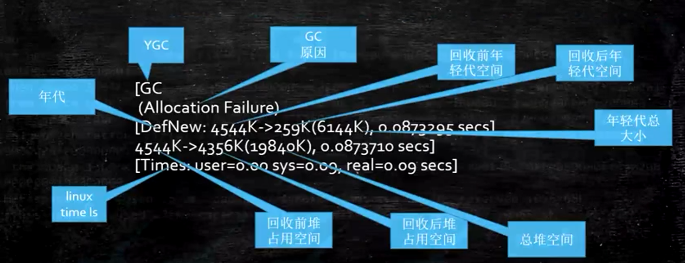

### 14.2、Heap dump

```txt
eden space 5632K, 94% used [0x00000000ff980000,0x00000000ffeb3e28,0x00000000fff00000)
方框中表示的是内存地址，1位置是起始地址，2位置是使用空间结束地址，3位置是整体空间结束地址
```

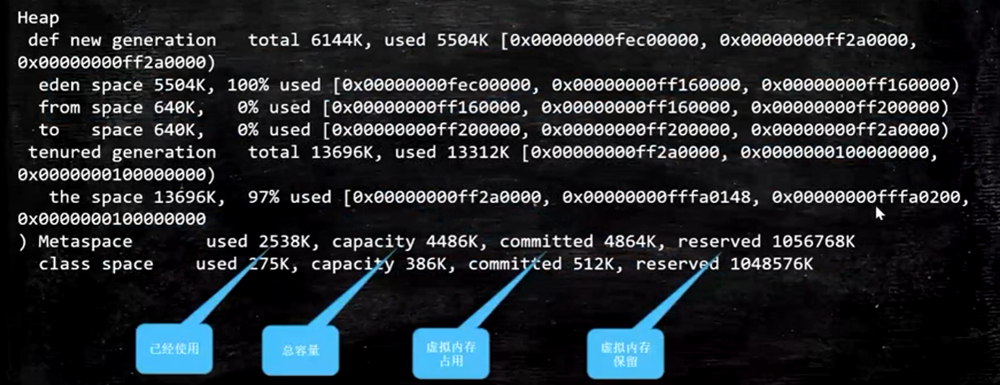

### 14.3、G1日志

执行命令：

> xx

日志：

```java
[GC pause (G1 Evacuation Pause) (young) (initial-mark), 0.0015790 secs]
//young -> 年轻代 Evacuation-> 复制存活对象 
//initial-mark 混合回收的阶段，这里是YGC混合老年代回收
   [Parallel Time: 1.5 ms, GC Workers: 1] 
//一个GC线程,以下是这个线程执行的具体过程
      [GC Worker Start (ms):  92635.7]
      [Ext Root Scanning (ms):  1.1]
      [Update RS (ms):  0.0]
         [Processed Buffers:  1]
      [Scan RS (ms):  0.0]
      [Code Root Scanning (ms):  0.0]
      [Object Copy (ms):  0.1]
      [Termination (ms):  0.0]
         [Termination Attempts:  1]
      [GC Worker Other (ms):  0.0]
      [GC Worker Total (ms):  1.2]
      [GC Worker End (ms):  92636.9]
   [Code Root Fixup: 0.0 ms]
   [Code Root Purge: 0.0 ms]
   [Clear CT: 0.0 ms]
   [Other: 0.1 ms]
      [Choose CSet: 0.0 ms]
      [Ref Proc: 0.0 ms]
      [Ref Enq: 0.0 ms]
      [Redirty Cards: 0.0 ms]
      [Humongous Register: 0.0 ms]
      [Humongous Reclaim: 0.0 ms]
      [Free CSet: 0.0 ms]
   [Eden: 0.0B(1024.0K)->0.0B(1024.0K) Survivors: 0.0B->0.0B Heap: 18.8M(20.0M)->18.8M(20.0M)]
 [Times: user=0.00 sys=0.00, real=0.00 secs] 
//以下是混合回收其他阶段
[GC concurrent-root-region-scan-start]
[GC concurrent-root-region-scan-end, 0.0000078 secs]
[GC concurrent-mark-start]
//无法evacuation，进行FGC
[Full GC (Allocation Failure)  18M->18M(20M), 0.0719656 secs]
   [Eden: 0.0B(1024.0K)->0.0B(1024.0K) Survivors: 0.0B->0.0B Heap: 18.8M(20.0M)->18.8M(20.0M)], [Metaspace: 38
76K->3876K(1056768K)] [Times: user=0.07 sys=0.00, real=0.07 secs]
```

### 14.4、CMS日志

**命令：**

> java -Xms20M -Xmx20M -XX:+PrintGCDetails -XX:+UseConcMarkSweepGC com.ouyangliuy.jvm.gc.FullGC_Problem01

**日志：**

```java
[GC (CMS Initial Mark) [1 CMS-initial-mark: 8511K(13696K)] 9866K(19840K), 0.0040321 secs] [Times: user=0.01 sys=0.00, real=0.00 secs] 
	//8511 (13696) : 老年代使用（最大）
	//9866 (19840) : 整个堆使用（最大）
[CMS-concurrent-mark-start]
[CMS-concurrent-mark: 0.018/0.018 secs] [Times: user=0.01 sys=0.00, real=0.02 secs] 
	//这里的时间意义不大，因为是并发执行
[CMS-concurrent-preclean-start]
[CMS-concurrent-preclean: 0.000/0.000 secs] [Times: user=0.00 sys=0.00, real=0.00 secs] 
	//标记Card为Dirty，也称为Card Marking
[GC (CMS Final Remark) [YG occupancy: 1597 K (6144 K)][Rescan (parallel) , 0.0008396 secs][weak refs processing, 0.0000138 secs][class unloading, 0.0005404 secs][scrub symbol table, 0.0006169 secs][scrub string table, 0.0004903 secs][1 CMS-remark: 8511K(13696K)] 10108K(19840K), 0.0039567 secs] [Times: user=0.00 sys=0.00, real=0.00 secs] 
	//STW阶段，YG occupancy:年轻代占用及容量
	//[Rescan (parallel)：STW下的存活对象标记
	//weak refs processing: 弱引用处理
	//class unloading: 卸载用不到的class
	//scrub symbol(string) table: 
		//cleaning up symbol and string tables which hold class-level metadata and 
		//internalized string respectively
	//CMS-remark: 8511K(13696K): 阶段过后的老年代占用及容量
	//10108K(19840K): 阶段过后的堆占用及容量

[CMS-concurrent-sweep-start]
[CMS-concurrent-sweep: 0.005/0.005 secs] [Times: user=0.00 sys=0.00, real=0.01 secs] 
	//标记已经完成，进行并发清理
[CMS-concurrent-reset-start]
[CMS-concurrent-reset: 0.000/0.000 secs] [Times: user=0.00 sys=0.00, real=0.00 secs]
	//重置内部结构，为下次GC做准备

```

## 15、GC常用参数

### 15.1、通用参数

- -Xmn   -Xms   -Xmx  -Xss

  > 年轻代，最小堆，最大堆，栈空间
  >
- -XX:+UseTLAB

  > 使用TLAB，默认是打开
  >
- -XX:TLABSiz

  > 设置TLAB大小
  >
- -XX:+DisableExplictGC

  > 禁用System.gc()，因为方法会发生FGC
  >
- -XX:+PrintGC
- -XX:+PrintGCDetails
- -XX:+PrintHeapAtGC
- -XX:+PrintGCTimeStamps
- -XX:+PrintGCApplicationConcurrentTime
- -XX:+PrintGCApplicationStoppedTime
- -XX:+PrintReferenceGC

  > 记录回收了多少种不同引用类型的引用
  >
- -verbose:class

  > 类加载详细过程
  >
- -XX:+PrintVMOptions

  > 打印程序执行的参数
  >
- -XX:+PrintFlagsFinal，-XX:+PrintFlagsInitial

  > 查找程序运行中参数和初始化的参数
  >
- -Xloggc:opt/log/gc.log

  > GC发生的日志地址
  >
- -XX:MaxTenuringThreshold

  > 升代年龄，最大值15，只有CMS是6
  >
- -XX:PreBlockSpin

  > 锁自旋次数，不建议设置
  >
- -XX:CompileThreshold

  > 热点代码检测参数
  >
- 逃逸分析、标量替换...（不建议设置）

### 15.1、Parallel常用参数

- -XX:SurvivorRatio

  > Eden区域和Survivor区域（From幸存区或To幸存区）的比例，默认是8，From幸存区和To幸存区各占新生代的1/10
  >
- -XX:PreTenureSizeThreshold

  > 大对象到底多大
  >
- -XX:MaxTenuringThreshold
- -XX:+ParallelGCThreads

  > 并行收集器的线程数，同样适用于CMS，一般设为和CPU核数相同
  >
- -XX:+UseAdaptiveSizePolicy

  > 自动选择各区大小比例
  >

### 15.2、CMS常用参数

- -XX:+UseConcMarkSweepGC

  > 指定JVM使用CMS垃圾收集器
  >
- -XX:ParallelCMSThreads

  > CMS线程数
  >
- -XX:CMSInitiatingOccupancyFraction

  > 使用多少比例的老年代后开始CMS收集，默认是68%(近似值)，如果频繁发生SerialOld卡顿，应该调小，（频繁CMS回收）
  >
- -XX:UseCMSCompactAtFullCollection

  > 在FGC时进行压缩
  >
- -XX:CMSFullGCsBeforeCompaction

  > 多少次FGC之后进行压缩
  >

  > 以上两个参数，可以解决CMS，碎片化问题
  >
- -XX:+CMSClassUnloadingEnabled

  > 卸载，class类文件对象
  >
- -XX:CMSInitiatingPermOccupancyFraction

  > 达到什么比例时会进行Perm回收
  >
- GCTimeRatio

  > 设置GC时间占用程序运行时间的百分比
  >
- -XX:MaxGCPauseMillis

  > 停顿时间，是一个建议时间，GC会尝试各种手段达到这个时间，比如减小年轻代
  >

### 15.3、G1常用参数

- -XX:UserG1GC
- -XX:MaxGCPauseMillis

  > GC暂停时间，建议值，G1会尝试增加Young区的块数来达到这个值
  >
- -XX:GCPasuseIntervalMillis

  > GC暂停间隔时间
  >
- -XX:G1HeapRegionSize

  > 分区大小，建议逐渐增大该值，1 2 4 8 16 32（M）
  >
  > 随着size增加，垃圾的存活时间更长，GC间隔更长，但每次GC的时间也会更长，
  >
  > ZGC做了改动（动态区块大小）
  >
- -XX:G1NewSizePercent

  > G1新生代最小比例，默认为5%
  >
- -XX:G1MaxNewSizePercent

  > G1新生代最大比例，默认60%
  >
- G1TimeRatio

  > GC时间建议比例，G1会根据这个值调整堆空间
  >
- ConcGCThreads

  > GC线程数
  >
- InitiatingHeapOccupancyPercent

  > 启动G1的堆空间占用比例
  >

## 16、面试常见问题

题：

1. -XX:MaxTenuringThreshold控制的是什么？
2. 生产环境中，倾向于将最大堆内存和最小堆内存设置为：（为什么？）
3. JDK1.8默认的垃圾回收器是：
4. 什么是响应时间优先？
5. 什么是吞吐量优先？
6. ParNew和PS的区别是什么？
7. ParNew和ParallelOld的区别是什么？（年代不同，算法不同）
8. 长时间计算的场景应该选择：A：停顿时间 B: 吞吐量
9. 大规模电商网站应该选择：A：停顿时间 B: 吞吐量
10. HotSpot的垃圾收集器最常用有哪些？
11. 常见的HotSpot垃圾收集器组合有哪些？
12. JDK1.7 1.8 1.9的默认垃圾回收器是什么？如何查看？
13. 所谓调优，到底是在调什么？
14. 如果采用PS + ParrallelOld组合，怎么做才能让系统基本不产生FGC
15. 如果采用ParNew + CMS组合，怎样做才能够让系统基本不产生FGC
16. G1是否分代？G1垃圾回收器会产生FGC吗？
17. 果G1产生FGC，你应该做什么？
18. 问：生产环境中能够随随便便的dump吗？
19. 问：常见的OOM问题有哪些？

答案：

```txt
1:对象升入老年代的年龄
2:相同 
3:PS + ParallelOld
4:STW越短，系统越顺畅、不卡顿，响应时间越好
5:吞吐量 = 运行用户代码时间 /（运行用户代码时间 + 垃圾收集时间）
6:PS和PN使用复制并行算法，PS更更关注吞吐量，可以设置停顿时间，PN配合CMS使用
7:年代不同，算法不同，PN：新生代，使用COPY算法，PO：老年代，使用标记清除算法
8：吞吐量
9：停顿时间
10：Serial,SerialOld,PS，PO，PN，CMS，G1
11：Serial+SerialOld,PS+PO，PN+CMS，G1
12:PS+PO,PS+PO,G1，使用-XX:+PrintCommandLineFlags参数可查看默认设置收集器类型
	或使用-XX:+PrintGCDetails亦可通过打印的GC日志的新生代、老年代名称判断
13:根据需求进行JVM规划和预调优，
	优化运行JVM运行环境（慢，卡顿）
	解决JVM运行过程中出现的各种问题(JVM调优主要就是为了解决OOM问题)
14:加大JVM内存，加大young的比例，提高Y-O的年龄，提高S区的比例，避免代码内存泄漏
15:加大JVM内存，加大young的比例，提高Y-O的年龄，提高S区的比例，避免代码内存泄漏
16：分代，会产生FGC
17：扩内存，提高CPU性能，降低MixedGC触发的阈值，让MixedGC提早发生（默认是45%）
18：小堆影响不大，大堆会有服务暂停或卡顿（加live可以缓解），dump前会有FGC
19：栈，堆，MethodArea，直接内存
```

## 17、参考资料

1. JVM参数参考文档：https://docs.oracle.com/javase/8/docs/technotes/tools/unix/java.html
2. JVM参数参考文档：https://www.oracle.com/java/technologies/javase/vmoptions-jsp.html
3. JVM调优参考文档：https://docs.oracle.com/en/java/javase/13/gctuning/introduction-garbage-collection-tuning.html#GUID-326EB4CF-8C8C-4267-8355-21AB04F0D304
4. arthas排查工具：https://www.cnblogs.com/nxlhero/p/11660854.html
5. arthas常用命令：https://www.jianshu.com/p/507f7e0cc3a3
