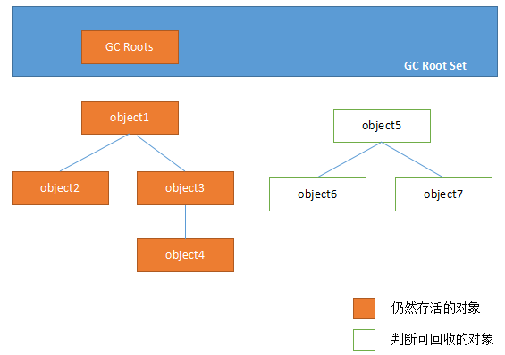
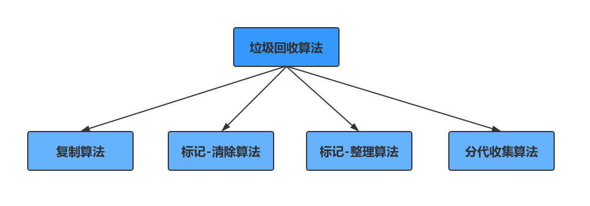
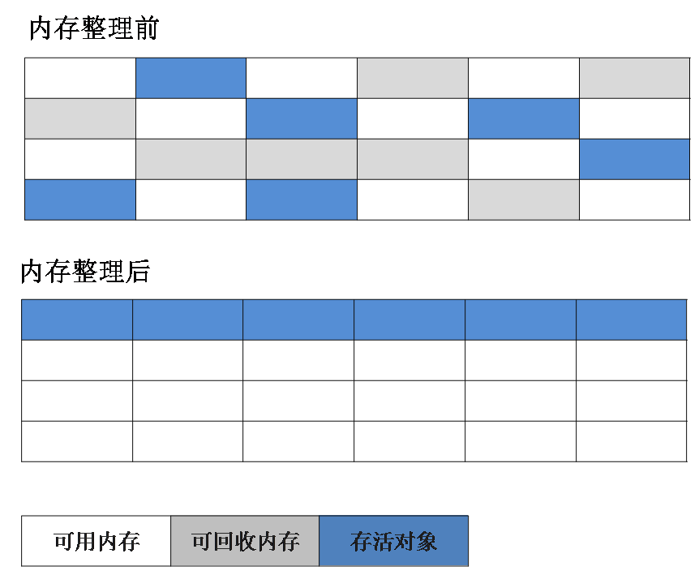
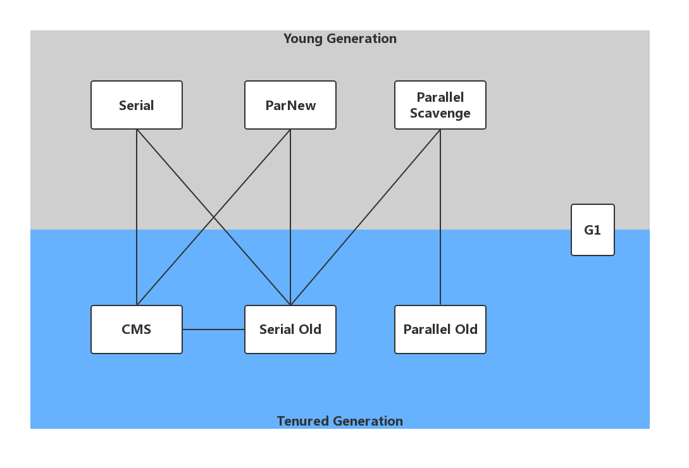

# GC算法和收集器

可参考

## 如果判断对象可以被回收

杜仲几乎放着所有的对象实例，堆垃圾回收前的第一步就是要判断哪些对象已经死亡（即不能再被任何途径使用的对象）

### 引用计数器法

给对象添加一个引用计数器，每当有一个地方引用，计数器就加1,当引用失效，计数器就减1,任何时候计数器为0的对象就是不可能再被使用的。

这个方法简单，效率高，但是目前主流的虚拟机中没有选择这个算法来管理内存，最主要的原因是它能男解决对像之间相互循环引用的问题，所谓对象之间的相互引用问题，通过下面代码所示：除了对象a和b相互引用着对方之外，这两个对象之间再无任何引用。但是他们因为互相引用对方，导致他们的引用计数器不为0,于是引用计数器无法通知GC回收器回收他们。

### 可达性分析算法

这个算法的基本思路就是通过一系列的称为**GC Roots**的对象作为起点，从这些节点开始向下搜索，节点所走过的路径称为引用链，当一个对象到**GC Roots**没有任何引用链相连的话，则证明此对象是不可用的。

**GC Roots ** 根节点：类加载器、Thread、虚拟机栈的本地变量表、static成员、常量引用、本地方法栈的变量等

### 如何判断一个常量是废弃常量

运行时常量池主要回收的是废弃常量。那么，如果判断一个常量是废弃常量呢？

假如在常量池中存在字符串 abc ，如果当前没有任何String对象引用该字符串常量的话，就说明常量 abc就是废弃常量，如果这时发生内存回收的话而且有必要的话，abc就会被系统清理出常量池。

### 如何判断一个类是无用的类

需要满足一下三个条件：

- 该类所有的实例都已经被回收，也就是Java堆中不存在该类得到任何实例。
- 加载该类的ClassLoader已经被回收。
- 该类对应的java.lang.class对象没有在任何地方被引用，无法在任何地方通过反射访问该类的方法。

虚拟机可以对满足上述3个条件的无用类进行回收，这里仅仅是 ”可以“，而不是和对象一样不适用了就必然被回收。

## 垃圾回收算法

###  标记-清除算法

他是最基础的收集算法，这个算法分为两个阶段，**标记** 和 **清除**。首先标记出多有需要回收的对象，在标记完成之后统一回收所有被标记的对象。它有两个不足的地方：

1. 效率问题：标记和清除两个过程效率都不高
2. 空间问题：标记清除后会产生大量不连续的碎片

### 复制算法

为了解决效率问题，复制算法出现了哦，他可以把内存分为大小相同的两块，每次只使用其中的一块，当这一块内存使用完后，就将还存活的对象复制到另一块区，然后在把使用的空间一次性清理掉，这就就会使每次的内存回收都是对内存空间的一般进行回收。

### 标记-整理算法

根据老年代的特点提出来的一种标记算法，标记过程和 **标记-清除**算法一样，但是后续步骤不是直接对可回收对象进行回收，而是让所有存活的对象向一段移动，然后直接清理掉边界以外的内存。

### 分带收集算法

现在商用虚拟机的垃圾回收器基本都采用**分代收集**算法，这种算法就是根据对象存活周期的不同将内存分为几块。一般将Java堆分为新生代和老年代，这样我们就可以根据各个年代的特点选择合适的垃圾收集算法。

在新生代中，每次收集都有大量对象死去，所以可以选择复制算法，只要付出少量对象的复制诚布就可以完成每次垃圾收集，而老年代的对象存活几率比较高，而且没有额外的空间对它进行分配担保，就必须选择 **标记-清除** 或者**标记-整理**算法进行垃圾收集。

# 垃圾收集器

Java虚拟机规范对垃圾收集起应该如何实现没有任何规定，因为没有所谓最好的垃圾收集起出现，跟不会有万金油的垃圾收集器，只能是根据具体的应用场景选择合适的垃圾收集器。

## Serial收集器

Serial（串行）收集器收集器是最基本、历史最悠久的垃圾收集器了。大家看名字就知道这个收集器是一个单线程收集器了。它的 “单线程” 的意义不仅仅意味着它只会使用一条垃圾收集线程去完成垃圾收集工作，更重要的是它在进行垃圾收集工作的时候必须暂停其他所有的工作线程（ “Stop The World” ），直到它收集结束。

新生代采用复制算法，老年代采用标记-整理算法。

虚拟机的设计者们当然知道Stop The World带来的不良用户体验，所以在后续的垃圾收集器设计中停顿时间在不断缩短（仍然还有停顿，寻找最优秀的垃圾收集器的过程仍然在继续）。

但是Serial收集器有没有优于其他垃圾收集器的地方呢？当然有，它**简单而高效（与其他收集器的单线程相比）**。Serial收集器由于没有线程交互的开销，自然可以获得很高的单线程收集效率。Serial收集器对于运行在Client模式下的虚拟机来说是个不错的选择。

## ParNew收集器

ParNew收集器其实就是Serial收集器的多线程版本，除了使用多线程进行垃圾收集外，其余行为（控制参数、收集算法、回收策略等等）和Serial收集器完全一样。

新生代采用复制算法，老年代采用标记-整理算法。 

它是许多运行在Server模式下的虚拟机的首要选择，除了Serial收集器外，只有它能与CMS收集器（真正意义上的并发收集器，后面会介绍到）配合工作。

## Parallel Scavenge 收集器

Parallel Scavenge 收集器类似于ParNew 收集器。

Parallel Scavenge收集器关注点是吞吐量（高效率的利用CPU）。CMS等垃圾收集器的关注点更多的是用户线程的停顿时间（提高用户体验）。所谓吞吐量就是CPU中用于运行用户代码的时间与CPU总消耗时间的比值。 Parallel Scavenge收集器提供了很多参数供用户找到最合适的停顿时间或最大吞吐量，如果对于收集器运作不太了解的话，手工优化存在的话可以选择把内存管理优化交给虚拟机去完成也是一个不错的选择。

新生代采用复制算法，老年代采用标记-整理算法。 

## Serial Old 收集器

Serial收集器的老年代版本，它同样是一个单线程收集器。它主要有两大用途：一种用途是在JDK1.5以及以前的版本中与Parallel Scavenge收集器搭配使用，另一种用途是作为CMS收集器的后备方案。

## Parallel Old 收集器

Parallel Scavenge收集器的老年代版本。使用多线程和“标记-整理”算法。在注重吞吐量以及CPU资源的场合，都可以优先考虑 Parallel Scavenge收集器和Parallel Old收集器。

## CMS 收集器

并行和并发概念补充：

- 并行（Parallel）：指多条垃圾收集线程并行工作，但此时用户线程仍然处于等待状态。
- 并发（Concurrent）：指用户线程与垃圾收集线程同时执行（但不一定是并行，可能交替执行），用户程序在继续运行，而垃圾收集器运行在另一个CPU上。

**CMS（Concurrent Mark Sweep）收集器是以牺牲吞吐量为代价来获取最短回收停顿时间为目标的收集器**。它非常适合运用在要求服务器响应速度很高的情况下。

CMS收集器是HotSport虚拟机第一款真正意义上的并发收集器，它第一次实现了让垃圾收集线程与用户线程（基本上）同时工作。

从名字中得到Mark Sweep这两个词可以看出，CMS收集器是一种 **标记-清除**算法实现的，它的 运作过程相比与前面几种垃圾收集器来说更加复杂一些，整个过程分为四个步骤：

1. **初始标记（CMS init mark）**：暂停所有其他线程，并记录下直接 与root相连的对象，这个速度非常快。
2. **并发标记（CMS concurrent mark)**：同时开启GC和用户线程，用一个闭包结构去记录可达对象，但在这个阶段结束，这个闭包结果并不能保证包含当前所有的可达对象，因为用户线程可能会不断的更新引用域，所以GC线程无法保证可达性分析的实时性，所以这个算法里会跟踪记录这些发生引用更新的地方。
3. **重新标记（CMS remark）**：重新标记阶段就是为了修正并发标记期间因为用户线程继续运行而导致产生变动的那一部分对象的标记记录，这个阶段的停顿时间一般会比初始标记阶段的时间稍长，远远比并发标记的时间短。
4. **并发清除（CMS concurrent sweep）**：开启用户线程，同时GC线程开始对为标记的区域做清扫。

CMS主要优点：并发收集、低停顿。但是他又三个明显的缺点：

- 对CPU资源敏感；
- 无法处理浮动垃圾;
- 他使用回收算法**标记-清除**算法会导致收集结束时会有大量空间碎片产生。

## G1收集器

G1（Garbage-First）是一款面向服务器的垃圾收集器，主要针对配备多颗处理器及大容量内存的机器。以极高概率满足GC停顿时间要求的同时，还具备高吞吐量性能特征。

 

被视为JDK1.7中HotSpot虚拟机的一个重要进化特征。它具备一下特点：

- **并行与并发**：G1能充分利用CPU、多核环境下的硬件优势，使用多个CPU（CPU或者CPU核心）来缩短Stop-The-World停顿时间，部分其他收集器原本需要停顿Java线程执行的GC动作，G1收集器仍然可能通过并发的方式让java程序继续执行
- **分带收集器**：虽然G1可以不需要其他收集器配合就能独立管理整个GC堆，但是还是保留了分代的概念。
- **空间整合**：与CMS的**标记-清除**算法不同，G1从整体来看是基于**标记-整理**算法实现的收集器，从局部上来看是基于**复制**算法实现的
- **可预测的停顿**：这是G1相对于CMS的另一大优势，降低停顿时间是G1和CMS共同的关注点，但G1除了追求低停顿外，还能建立可预测的停顿时间模型，能让使用者明确指定在一个长度为M毫秒的时间片段 内。

G1收集器的运作大致分为一下几个步骤：

1. **初始标记**
2. **并发标记**
3. **最终标记**
4. **筛选回收**

G1收集器在后台维护了一个优先列表，每次根据允许的收集时间，优先选择回收价值最大的Region（）。这种使用Region划分内存空间以及有优先级的区域回收的方式，保证了GF收集器在优先时间内可以尽可能高的收集效率（把内存化整为零）。

# ZGC

> 是 **Java 11** 中引入的一种 **可扩展、低延迟的垃圾收集器**，目标是在**GC暂停时间不超过10ms**的情况下，**处理TB级堆内存**，适用于对**响应时间敏感**的系统，例如在线服务、大数据、金融系统等

## Region-based（分区内存管理）

- 内存分为多个等大小的 **Region**（类似G1）。
- Region 不区分 Eden、Survivor、Old，所有对象统一放在 region 中，按生命周期自动管理。

## 使用指针染色（Colored Pointers）

ZGC 不使用传统的 GC 卡表标记，而是利用 64 位指针的 **高位 bits（染色位）** 记录元信息。

如：

- 标记是否被 GC 访问过；
- 对象是否被转移（Forwarded）；
- 这些染色位不会影响对象的地址。

>  这让 ZGC 能够实现**并发压缩移动对象时的地址重定向**，是其核心创新之一。

## 并发压缩（Concurrent Relocation）

- GC 可以在不暂停应用线程的情况下移动对象；
- 通过“读屏障（Load Barrier）实现地址访问重定向；
- 所有阶段几乎都是并发完成的，只有少数步骤会有很短的“stop-the-world”暂停。

| **目标**     | **说明**                                                    |
| ------------ | ----------------------------------------------------------- |
| **低延迟**   | GC 暂停时间控制在 10ms 以内（不随堆大小线性增长）           |
| **可扩展性** | 支持超大堆（最大可达 **16TB**）                             |
| **并发性强** | 所有阶段几乎都与应用线程并发执行                            |
| **可移植性** | 支持多平台（Linux, Windows, macOS）、多架构（x64、aarch64） |

## ZGC 工作流程（GC 生命周期）

ZGC 的 GC 流程分为多个阶段，大多数是**并发**执行的：

### 1. Mark Start （短暂停止）

- 停止所有线程，开始并发标记。
- 这一步时间很短，一般 <1ms。

### 2. Concurrent Mark（并发标记）

- 与应用线程并发执行；
- 标记所有可达对象；
- 记录引用关系图。

### 3. Relocation Set Selection

- 基于标记阶段的存活率，选出需要回收或压缩的 Region。

### 4. Prepare for Relocation（并发）

- 构建转发表；
- 为对象搬迁做准备。

### 5. Relocate Start（短暂停止）

- 再次暂停所有线程；
- 设置迁移阶段的元信息；
- 暂停时间同样非常短。

### 6. Concurrent Relocate

- 与应用线程并发迁移对象；
- 利用 load barrier 技术确保读取的是迁移后的新地址

与其他收集器对比：

| **特性**     | **CMS**      | **G1**       | **ZGC**          | **Shenandoah** |
| ------------ | ------------ | ------------ | ---------------- | -------------- |
| 最早支持版本 | Java 5       | Java 7/8     | Java 11          | Java 12        |
| 暂停时间     | 毫秒级       | 毫秒~百毫秒  | 低于10ms（目标） | 低于10ms       |
| 吞吐量       | 高           | 中           | 中               | 中等偏低       |
| 可扩展性     | 差（~4-8GB） | 一般（10GB） | 高（支持 TB）    | 高             |
| 并发压缩     | ❌            | ✅（有限）    | ✅                | ✅              |
| Region管理   | 无           | 有           | 有               | 有             |
| 负载均衡     | 无           | 有           | 有               | 有             |

### **适合场景：**

- 响应时间要求极高（<10ms）的服务；
- 堆内存超大（几十 GB ~ TB）；
- 低暂停要求远高于吞吐需求（如搜索服务、在线交易、金融风控等）。

### ❌ 不适合场景：

- 对吞吐量有极高要求的批处理；
- CPU 核心数太少的机器（ZGC 并发阶段依赖 CPU 并发）；
- 小堆内存应用（<4GB）使用收益不大。

**ZGC 是为了解决“堆大导致GC暂停时间长”的问题，它通过 colored pointers + 并发压缩 + load barrier 实现了超低延迟、高可扩展性的垃圾回收，是下一代面向大型服务的 GC 技术**

## 怎么选择垃圾收集器？

1. 优先调整堆的大小让服务器来自己选择。
2. 如果内存小雨100M，使用串行收集器。
3. 如果是单核，并且没有停顿时间要求，使用串行或者JVM自己选择。
4. 如果允许停顿时间超过1秒，选择并行或者JVM自己选。
5. 如果响应时间最重要，并且不能超过1秒，使用并发收集器。
