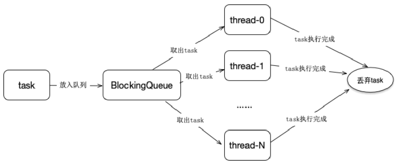

# 1、Java线程与常用线程池体系 

## 1.1、Java线程实现方式

### 1.1.1、继承Thread

1. **继承Thread**
1. 定义Thread类的子类，并重写该类的run方法，该run方法的方法体就代表了线程要完成的任务。因此把run()方法称为执行体。
2. 创建Thread子类的实例，即创建了线程对象。
3. 调用线程对象的start()方法来启动该线程。

### 1.1.2、实现runnable接口

（1）定义runnable接口的实现类，并重写该接口的run()方法，该run()方法的方法体同样是该线程的线程执行体。

（2）创建 Runnable实现类的实例，并以此实例作为Thread的target来创建Thread对象，该Thread对象才是真正的线程对象。

（3）调用线程对象的start()方法来启动该线程。

### 1.1.3、实现callable接口

1）创建Callable接口的实现类，并实现call()方法，该call()方法将作为线程执行体，并且有返回值。
       public interface Callable{
　　      V call() throws Exception; }
2）创建Callable实现类的实例，使用FutureTask类来包装Callable对象，该FutureTask对象封装了该Callable对象的call()方法的返回值。（FutureTask是一个包装器，它通过接受Callable来创建，它同时实现了Future和Runnable接口）
3）使用FutureTask对象作为Thread对象的target创建并启动新线程。
4）调用FutureTask对象的get()方法来获得子线程执行结束后的返回值。

```java
public class Demo implements Callable<Integer>  {  
  
    public static void main(String[] args)  
    {  
        Demo demo = new Demo ();  
        FutureTask<Integer> ft = new FutureTask<>(demo); 
        new Thread(ft ,"有返回值的线程").start();
        ft.get();
    } 
    @Override  
    public Integer call() throws Exception  
    {  
          return 1;  
    }  
}
```


## 1.2、常用线程池体系 

1. Executor：线程池顶级接口
2. ExecutorService：线程池次级接口，对Executor做了一些扩展，增加了一些功能
3. ScheduleExecutorService：对ExecutorService做了一些扩展，增加了一些订什任务相关的功能
4. AbstractExecutorService：抽象类，运用模板方法设计模式实现了一部分方法
5. ThreadPoolExecutor：普通线程池类，包含最基本的一些线程池操作相关的方法实现
6. ScheduleThreadPoolExecutor：定时任务线程池类，用于实现定时任务相关功能
7. ForkJoinPool：新型线程池类，Java7中新增的线程池类，基于工作窃取理论实现，用于大任务拆小任务，任务无限多的场景
8. Executors：线程池工具类，定义了一些快速实现线程池的方法

### 1.2.1、Executor

```java
public interface Executor {

    /**
     * Executes the given command at some time in the future.  The command
     * may execute in a new thread, in a pooled thread, or in the calling
     * thread, at the discretion of the {@code Executor} implementation.
     * 执行无返回值任务,根据Executor的实现判断，可能是在新线程、线程池、线程调用中执行 
     */
    void execute(Runnable command);
}
```

### 1.2.2、ExecutorService

```java
public interface ExecutorService extends Executor {

    // 关闭线程池，不再接受新任务，但已经提交的任务会执行完成
    void shutdown();

    /**
     * 立即关闭线程池，尝试停止正在运行的任务，未执行的任务不在执行，被迫停止及未执行的任务将以列表形式返回
     */
    List<Runnable> shutdownNow();
	// 检查线程状态是否已关闭
    boolean isShutdown();

    /**
     * Returns {@code true} if all tasks have completed following shut down.
     * Note that {@code isTerminated} is never {@code true} unless
     * either {@code shutdown} or {@code shutdownNow} was called first.
     * 检查线程是否已终止，只有在shutdown()或shutdownNow()之后调用才为true
     */
    boolean isTerminated();

    /**
     * Blocks until all tasks have completed execution after a shutdown
     * request, or the timeout occurs, or the current thread is
     * interrupted, whichever happens first.
     * @return {@code true} if this executor terminated and
     * 		   {@code false} if the timeout elapsed before termination
     * 在指定时间内线程池达到终止状态了才会返回true
     */
    boolean awaitTermination(long timeout, TimeUnit unit)
        throws InterruptedException;

    /**
     * Submits a value-returning task for execution and returns a
     * Future representing the pending results of the task. The
     * Future's {@code get} method will return the task's result upon
     * successful completion.
     *
     * 执行有返回值的任务，任务的返回值为task.call()的结果
     */
    <T> Future<T> submit(Callable<T> task);

    /**
     * Submits a Runnable task for execution and returns a Future
     * representing that task. The Future's {@code get} method will
     * return the given result upon successful completion.
     * 执行有返回值的任务，任务的返回值为这里传入的result 
     * 当然只有当任务执行完成了调用get()时才会返回
     */
    <T> Future<T> submit(Runnable task, T result);

    /**
     * Submits a Runnable task for execution and returns a Future
     * representing that task. The Future's {@code get} method will
     * return {@code null} upon <em>successful</em> completion.
     * 执行有返回值的任务，任务的返回值为null，当然只有当任务执行完成了调用get()时才会返回
     */
    Future<?> submit(Runnable task);

    /**
     * Executes the given tasks, returning a list of Futures holding
     * their status and results when all complete.
     * {@link Future#isDone} is {@code true} for each
     * element of the returned list.
     * Note that a <em>completed</em> task could have
     * terminated either normally or by throwing an exception.
     * The results of this method are undefined if the given
     * collection is modified while this operation is in progress.
     * 批量执行任务，只有当这些任务都完成了这个方法才会返回
     */
    <T> List<Future<T>> invokeAll(Collection<? extends Callable<T>> tasks)
        throws InterruptedException;

    /**
     * Executes the given tasks, returning a list of Futures holding
     * their status and results
     * when all complete or the timeout expires, whichever happens first.
     * {@link Future#isDone} is {@code true} for each
     * element of the returned list.
     * Upon return, tasks that have not completed are cancelled.
     * Note that a <em>completed</em> task could have
     * terminated either normally or by throwing an exception.
     * The results of this method are undefined if the given
     * collection is modified while this operation is in progress.
     * 在指定时间内批量执行任务，未执行完成的任务将被取消
     * 这里的timeout是所有任务的总时间，不是单个任务的时间 
     */
    <T> List<Future<T>> invokeAll(Collection<? extends Callable<T>> tasks,
                                  long timeout, TimeUnit unit)
        throws InterruptedException;

    /**
     * Executes the given tasks, returning the result
     * of one that has completed successfully (i.e., without throwing
     * an exception), if any do. Upon normal or exceptional return,
     * tasks that have not completed are cancelled.
     * The results of this method are undefined if the given
     * collection is modified while this operation is in progress.
     * 返回任意一个已完成任务的执行结果，未执行完成的任务将被取消
     */
    <T> T invokeAny(Collection<? extends Callable<T>> tasks)
        throws InterruptedException, ExecutionException;

    /**
     * Executes the given tasks, returning the result
     * of one that has completed successfully (i.e., without throwing
     * an exception), if any do before the given timeout elapses.
     * Upon normal or exceptional return, tasks that have not
     * completed are cancelled.
     * The results of this method are undefined if the given
     * collection is modified while this operation is in progress.
     * 在指定时间内如果有任务已完成，则返回任意一个已完成任务的执行结果，未执行完成的任务将被取消
     */
    <T> T invokeAny(Collection<? extends Callable<T>> tasks,
                    long timeout, TimeUnit unit)
        throws InterruptedException, ExecutionException, TimeoutException;
```

### 1.2.3、AbstractExecutorService

```java

public abstract class AbstractExecutorService implements ExecutorService {

    /**
     * Returns a {@code RunnableFuture} for the given runnable and default
     * value.
     * 将runnable包装为RunnableFuture对象，返回值为T
     */
    protected <T> RunnableFuture<T> newTaskFor(Runnable runnable, T value) {
        return new FutureTask<T>(runnable, value);
    }

    /**
     * Returns a {@code RunnableFuture} for the given callable task.
     * 将callable包装为RunnableFuture
     */
    protected <T> RunnableFuture<T> newTaskFor(Callable<T> callable) {
        return new FutureTask<T>(callable);
    }

    public Future<?> submit(Runnable task) {
        if (task == null) throw new NullPointerException();
        RunnableFuture<Void> ftask = newTaskFor(task, null);
        execute(ftask);
        return ftask;
    }

    public <T> Future<T> submit(Runnable task, T result) {
        if (task == null) throw new NullPointerException();
        RunnableFuture<T> ftask = newTaskFor(task, result);
        execute(ftask);
        return ftask;
    }


    public <T> Future<T> submit(Callable<T> task) {
        if (task == null) throw new NullPointerException();
        RunnableFuture<T> ftask = newTaskFor(task);
        execute(ftask);
        return ftask;
    }

    /**
     * the main mechanics of invokeAny.
     */
    private <T> T doInvokeAny(Collection<? extends Callable<T>> tasks,
                              boolean timed, long nanos)
        throws InterruptedException, ExecutionException, TimeoutException {
        if (tasks == null)
            throw new NullPointerException();
        int ntasks = tasks.size();
        if (ntasks == 0)
            throw new IllegalArgumentException();
        ArrayList<Future<T>> futures = new ArrayList<>(ntasks);
        // 将this对象放入ecs中使用ecs，完成任务执行
        ExecutorCompletionService<T> ecs =
            new ExecutorCompletionService<T>(this);

        // For efficiency, especially in executors with limited
        // parallelism, check to see if previously submitted tasks are
        // done before submitting more of them. This interleaving
        // plus the exception mechanics account for messiness of main
        // loop.

        try {
            // Record exceptions so that if we fail to obtain any
            // result, we can throw the last exception we got.
            ExecutionException ee = null;
            // 判断一下是否是timed超时执行
            final long deadline = timed ? System.nanoTime() + nanos : 0L;
            Iterator<? extends Callable<T>> it = tasks.iterator();

            // Start one task for sure; the rest incrementally
            // 开始执行一个任务，剩余的任务减一个
            futures.add(ecs.submit(it.next()));
            --ntasks; //减少操作
            int active = 1;	//当前激活线程为1个

            for (;;) {
                Future<T> f = ecs.poll(); // 从阻塞队列中拿出上面添加的任务
                if (f == null) {	// 为null，说明没有执行完毕
                    if (ntasks > 0) {	// 需要执行线程还存在还有
                        --ntasks;
                        futures.add(ecs.submit(it.next()));	// 通过ecs执行
                        ++active;
                    }
                    else if (active == 0)
                        break;
                    else if (timed) {
                        f = ecs.poll(nanos, NANOSECONDS);
                        if (f == null)
                            throw new TimeoutException();
                        nanos = deadline - System.nanoTime();
                    }
                    else
                        f = ecs.take();
                }
                if (f != null) { // 不为空，执行完毕
                    --active;	// 激活线程数--
                    try {
                        return f.get();	// 拿到返回值
                    } catch (ExecutionException eex) {
                        ee = eex;
                    } catch (RuntimeException rex) {
                        ee = new ExecutionException(rex);
                    }
                }
            }

            if (ee == null)
                ee = new ExecutionException();
            throw ee;

        } finally {
            cancelAll(futures);
        }
    }

    public <T> T invokeAny(Collection<? extends Callable<T>> tasks)
        throws InterruptedException, ExecutionException {
        try {
            return doInvokeAny(tasks, false, 0);
        } catch (TimeoutException cannotHappen) {
            assert false;
            return null;
        }
    }

    public <T> T invokeAny(Collection<? extends Callable<T>> tasks,
                           long timeout, TimeUnit unit)
        throws InterruptedException, ExecutionException, TimeoutException {
        return doInvokeAny(tasks, true, unit.toNanos(timeout));
    }

    public <T> List<Future<T>> invokeAll(Collection<? extends Callable<T>> tasks)
        throws InterruptedException {
        if (tasks == null)
            throw new NullPointerException();
        ArrayList<Future<T>> futures = new ArrayList<>(tasks.size());
        try {
            // for 循环将callable任务包装成RunnableFuture，并执行
            for (Callable<T> t : tasks) {
                RunnableFuture<T> f = newTaskFor(t);
                futures.add(f);
                execute(f);
            }
            // for循环等待每个任务依次运行结束
            for (int i = 0, size = futures.size(); i < size; i++) {
                Future<T> f = futures.get(i);
                if (!f.isDone()) {
                    try { f.get(); }
                    catch (CancellationException | ExecutionException ignore) {}
                }
            }
            // 返回运行结果futures
            return futures;
        } catch (Throwable t) {
            cancelAll(futures);
            throw t;
        }
    }

    public <T> List<Future<T>> invokeAll(Collection<? extends Callable<T>> tasks,
                                         long timeout, TimeUnit unit)
        throws InterruptedException {
        if (tasks == null)
            throw new NullPointerException();
        final long nanos = unit.toNanos(timeout);
        final long deadline = System.nanoTime() + nanos;
        ArrayList<Future<T>> futures = new ArrayList<>(tasks.size());
        int j = 0;
        timedOut: try {
            for (Callable<T> t : tasks)	//添加任务
                futures.add(newTaskFor(t));

            final int size = futures.size();

            // Interleave time checks and calls to execute in case
            // executor doesn't have any/much parallelism.
            for (int i = 0; i < size; i++) {
                if (((i == 0) ? nanos : deadline - System.nanoTime()) <= 0L)
                    break timedOut;
                execute((Runnable)futures.get(i));	//执行所有任务，在超时时间之内
            }

            for (; j < size; j++) {
                Future<T> f = futures.get(j);
                if (!f.isDone()) {
                    try { f.get(deadline - System.nanoTime(), NANOSECONDS); }
                    catch (CancellationException | ExecutionException ignore) {}
                    catch (TimeoutException timedOut) {
                        break timedOut;
                    }
                }
            }
            return futures;
        } catch (Throwable t) {
            cancelAll(futures);
            throw t;
        }
        // Timed out before all the tasks could be completed; cancel remaining
        cancelAll(futures, j);
        return futures;
    }

    private static <T> void cancelAll(ArrayList<Future<T>> futures) {
        cancelAll(futures, 0);
    }

    /** Cancels all futures with index at least j. */
    private static <T> void cancelAll(ArrayList<Future<T>> futures, int j) {
        for (int size = futures.size(); j < size; j++)
            futures.get(j).cancel(true);
    }
}
```

#### 1.2.3.1、inovkeAny

总结：inovkeAny会出现执行多个任务，但只取第一个任务结果的情况

#### 1.2.3.2、invokeAll

总结：执行所有的方法，并返回所有的执行结果

### 1.2.4、ExecutorCompletionService

```java
public class ExecutorCompletionService<V> implements CompletionService<V> {
    private final Executor executor;
    private final AbstractExecutorService aes;
    private final BlockingQueue<Future<V>> completionQueue;

    /**
     * FutureTask extension to enqueue upon completion.
     */
    private static class QueueingFuture<V> extends FutureTask<Void> {
        QueueingFuture(RunnableFuture<V> task,
                       BlockingQueue<Future<V>> completionQueue) {
            super(task, null);
            this.task = task;
            this.completionQueue = completionQueue;
        }
        private final Future<V> task;
        private final BlockingQueue<Future<V>> completionQueue;
        protected void done() { completionQueue.add(task); }
    }

    private RunnableFuture<V> newTaskFor(Callable<V> task) {
        if (aes == null)
            return new FutureTask<V>(task);
        else
            return aes.newTaskFor(task);
    }

    private RunnableFuture<V> newTaskFor(Runnable task, V result) {
        if (aes == null)
            return new FutureTask<V>(task, result);
        else
            return aes.newTaskFor(task, result);
    }

    /**
     * Creates an ExecutorCompletionService using the supplied
     * executor for base task execution and a
     * {@link LinkedBlockingQueue} as a completion queue.
     *
     * @param executor the executor to use
     * @throws NullPointerException if executor is {@code null}
     */
    public ExecutorCompletionService(Executor executor) {
        if (executor == null)
            throw new NullPointerException();
        this.executor = executor;
        this.aes = (executor instanceof AbstractExecutorService) ?
            (AbstractExecutorService) executor : null;
        this.completionQueue = new LinkedBlockingQueue<Future<V>>();
    }

    /**
     * Creates an ExecutorCompletionService using the supplied
     * executor for base task execution and the supplied queue as its
     * completion queue.
     *
     * @param executor the executor to use
     * @param completionQueue the queue to use as the completion queue
     *        normally one dedicated for use by this service. This
     *        queue is treated as unbounded -- failed attempted
     *        {@code Queue.add} operations for completed tasks cause
     *        them not to be retrievable.
     * @throws NullPointerException if executor or completionQueue are {@code null}
     */
    public ExecutorCompletionService(Executor executor,
                                     BlockingQueue<Future<V>> completionQueue) {
        if (executor == null || completionQueue == null)
            throw new NullPointerException();
        this.executor = executor;
        this.aes = (executor instanceof AbstractExecutorService) ?
            (AbstractExecutorService) executor : null;
        this.completionQueue = completionQueue;
    }

    /**
     * @throws RejectedExecutionException {@inheritDoc}
     * @throws NullPointerException       {@inheritDoc}
     */
    public Future<V> submit(Callable<V> task) {
        if (task == null) throw new NullPointerException();
        RunnableFuture<V> f = newTaskFor(task);
        executor.execute(new QueueingFuture<V>(f, completionQueue));
        return f;
    }

    /**
     * @throws RejectedExecutionException {@inheritDoc}
     * @throws NullPointerException       {@inheritDoc}
     */
    public Future<V> submit(Runnable task, V result) {
        if (task == null) throw new NullPointerException();
        RunnableFuture<V> f = newTaskFor(task, result);
        executor.execute(new QueueingFuture<V>(f, completionQueue));
        return f;
    }

    public Future<V> take() throws InterruptedException {
        return completionQueue.take();
    }

    public Future<V> poll() {
        return completionQueue.poll();
    }

    public Future<V> poll(long timeout, TimeUnit unit)
            throws InterruptedException {
        return completionQueue.poll(timeout, unit);
    }

}
```

## 2、ThreadPoolExecutor

### 2.1、ThreadPoolExecutor原理




### 2.2、线程池的状态设计

1. RUNNING

   > Accept new tasks and process queued tasks
   >
   > 接收新任务，执行队列中任务

2. SHUTDOWN

   > Don't accept new tasks, but process queued tasks
   >
   > 不接受任务，执行队列任务

3. STOP

   > Don't accept new tasks, don't process queued tasks, and interrupt in-progress task
   >
   > 不接受任务，不执行队列中任务，中断正在执行的任务

4. TIDYING

   >  All tasks have terminated, workerCount is zero,the thread transitioning to state TIDYING will run the terminated() hook method.
   >
   >  所有的任务执行完毕，转化状态为TIDYING，执行terminated钩子函数

5. TERMINATED

   > terminated() has completed.
   >
   > 钩子函数执行完毕，状态为TERMINATED

```java
/*   RUNNING:  Accept new tasks and process queued tasks
*   SHUTDOWN: Don't accept new tasks, but process queued tasks
*   STOP:     Don't accept new tasks, don't process queued tasks,
*             and interrupt in-progress tasks
*   TIDYING:  All tasks have terminated, workerCount is zero,
*             the thread transitioning to state TIDYING
*             will run the terminated() hook method
			所有的任务执行完毕，转化状态为TIDYING，执行terminated钩子函数
*   TERMINATED: terminated() has completed
			// 钩子函数执行完毕，状态为TERMINATED
*/
```

**钩子函数：**

> 执行完主方法之后，需要执行的钩子函数，将执行结果通过钩子函数通知调用者

**使用int的高三位来表示运行的状态，其他位代笔线程运行数据**

```java
private final AtomicInteger ctl = new AtomicInteger(ctlOf(RUNNING, 0));
private static final int COUNT_BITS = Integer.SIZE - 3;
private static final int COUNT_MASK = (1 << COUNT_BITS) - 1;
// runState is stored in the high-order bits
private static final int RUNNING    = -1 << COUNT_BITS;		// 111 00..
private static final int SHUTDOWN   =  0 << COUNT_BITS;		// 000 00..
private static final int STOP       =  1 << COUNT_BITS;		// 001 00..
private static final int TIDYING    =  2 << COUNT_BITS;		// 010 00..
private static final int TERMINATED =  3 << COUNT_BITS;		// 011 00..
```

思考：为什么这样设计

> 此时只有ctl小于0，说明线程是在运行中的。条件判断非常方便。
>
> ```c
> if(ctl<0)
> 	doSomething();
> ```

### 2.2、ThreadPoolExecutor核心方法

#### 2.2.1、ThreadPoolExecutor拒绝策略

ThreadPoolExecutor中有默认四种拒绝策略实现，具体如下：

拒绝接口

```java
public interface RejectedExecutionHandler {
    void rejectedExecution(Runnable r, ThreadPoolExecutor executor);
}
```

##### 2.2.1.1、拒绝策略之抛出异常

```java
public static class AbortPolicy implements RejectedExecutionHandler {
    /**
     * Creates an {@code AbortPolicy}.
     */
    public AbortPolicy() { }

    /**
     * Always throws RejectedExecutionException.
     *
     * @param r the runnable task requested to be executed
     * @param e the executor attempting to execute this task
     * @throws RejectedExecutionException always
     */
    public void rejectedExecution(Runnable r, ThreadPoolExecutor e) {
        throw new RejectedExecutionException("Task " + r.toString() +
                                             " rejected from " +
                                             e.toString());
    }
}
```

##### 2.2.1.2、拒绝策略之丢弃啥也不做

```java
/**
 * A handler for rejected tasks that silently discards the
 * rejected task.
 */
public static class DiscardPolicy implements RejectedExecutionHandler {
    /**
     * Creates a {@code DiscardPolicy}.
     */
    public DiscardPolicy() { }

    /**
     * Does nothing, which has the effect of discarding task r.
     *
     * @param r the runnable task requested to be executed
     * @param e the executor attempting to execute this task
     */
    public void rejectedExecution(Runnable r, ThreadPoolExecutor e) {
    }
}
```

##### 2.2.1.3、拒绝策略之丢弃最老的执行最新的

```java
/**
 * A handler for rejected tasks that discards the oldest unhandled
 * request and then retries {@code execute}, unless the executor
 * is shut down, in which case the task is discarded.
 */
public static class DiscardOldestPolicy implements RejectedExecutionHandler {
    /**
     * Creates a {@code DiscardOldestPolicy} for the given executor.
     */
    public DiscardOldestPolicy() { }

    /**
     * Obtains and ignores the next task that the executor
     * would otherwise execute, if one is immediately available,
     * and then retries execution of task r, unless the executor
     * is shut down, in which case task r is instead discarded.
     *
     * @param r the runnable task requested to be executed
     * @param e the executor attempting to execute this task
     */
    public void rejectedExecution(Runnable r, ThreadPoolExecutor e) {
        if (!e.isShutdown()) {
            e.getQueue().poll();
            e.execute(r);
        }
    }
}
```

##### 2.2.1.4、拒绝策略之主线程自己执行任务

```java
/**
 * A handler for rejected tasks that runs the rejected task
 * directly in the calling thread of the {@code execute} method,
 * unless the executor has been shut down, in which case the task
 * is discarded.
 */
public static class CallerRunsPolicy implements RejectedExecutionHandler {
    /**
     * Creates a {@code CallerRunsPolicy}.
     */
    public CallerRunsPolicy() { }

    /**
     * Executes task r in the caller's thread, unless the executor
     * has been shut down, in which case the task is discarded.
     *
     * @param r the runnable task requested to be executed
     * @param e the executor attempting to execute this task
     */
    public void rejectedExecution(Runnable r, ThreadPoolExecutor e) {
        if (!e.isShutdown()) {
            r.run();
        }
    }
}
```

#### 2.2.2、ThreadFactory

```java
public interface ThreadFactory {

    /**
     * Constructs a new {@code Thread}.  Implementations may also initialize
     * priority, name, daemon status, {@code ThreadGroup}, etc.
     *
     * @param r a runnable to be executed by new thread instance
     * @return constructed thread, or {@code null} if the request to
     *         create a thread is rejected
     */
    Thread newThread(Runnable r);
}


private static class DefaultThreadFactory implements ThreadFactory {
    private static final AtomicInteger poolNumber = new AtomicInteger(1);
    private final ThreadGroup group;
    private final AtomicInteger threadNumber = new AtomicInteger(1);
    private final String namePrefix;

    DefaultThreadFactory() {
        SecurityManager s = System.getSecurityManager();
        group = (s != null) ? s.getThreadGroup() :
                              Thread.currentThread().getThreadGroup();
        namePrefix = "pool-" +
                      poolNumber.getAndIncrement() +
                     "-thread-";
    }

    public Thread newThread(Runnable r) {
        Thread t = new Thread(group, r,
                              namePrefix + threadNumber.getAndIncrement(),
                              0);
        // 由此可见，线程工程创建出的线程不是后台线程
        if (t.isDaemon())
            t.setDaemon(false);
        if (t.getPriority() != Thread.NORM_PRIORITY)
            t.setPriority(Thread.NORM_PRIORITY);
        return t;
    }
}
```

线程核心原理


阻塞队列

```java
/* A {@link Queue} that additionally supports operations that wait for
 * the queue to become non-empty when retrieving an element, and wait
 * for space to become available in the queue when storing an element.
 * 检索(获取)元素时，等待队列中直到有数据，添加元素直到有可用空间
 */
public interface BlockingQueue<E> extends Queue<E> {
     
 }     
```


#### 2.2.3、execute

总结：核心方法主要有以下步骤

1. 如果运行的线程数小于核心线程数，那么就新增一个核心线程去执行任务
2. 如果从队列中拿到一个任务，并重新检测状态，使用核心线程数去执行任务
3. 如果任务不能加入到队列中，那么尝试新启动一个线程去执行，这个线程是非核心线程数
4. 如果队列满了，运行的线程数已经是最大线程数了，那么就执行拒绝策略

```java
public void execute(Runnable command) {
    if (command == null)
        throw new NullPointerException();
    /*
     * Proceed in 3 steps:
     *
     * 1. If fewer than corePoolSize threads are running, try to
     * start a new thread with the given command as its first
     * task.  The call to addWorker atomically checks runState and
     * workerCount, and so prevents false alarms that would add
     * threads when it shouldn't, by returning false.
     *
     * 2. If a task can be successfully queued, then we still need
     * to double-check whether we should have added a thread
     * (because existing ones died since last checking) or that
     * the pool shut down since entry into this method. So we
     * recheck state and if necessary roll back the enqueuing if
     * stopped, or start a new thread if there are none.
     *
     * 3. If we cannot queue task, then we try to add a new
     * thread.  If it fails, we know we are shut down or saturated
     * and so reject the task.
     */
    int c = ctl.get();
    // 当前工作线程数，小于核心线程数，那么就添加到worker中，执行
    if (workerCountOf(c) < corePoolSize) {
        if (addWorker(command, true))
            return;
        c = ctl.get();
    }
    // 此时运行线程数已经大于了核心线程数，那么尝试添加任务到工作队列中，
    // 并重新检查是否已经有任务执行完成，或
    if (isRunning(c) && workQueue.offer(command)) {
        int recheck = ctl.get();
        if (! isRunning(recheck) && remove(command))
            reject(command);
        else if (workerCountOf(recheck) == 0)
            addWorker(null, false);
    }
    else if (!addWorker(command, false))	// 否则，就尝试添加为非核心线程数得线程去执行任务
        reject(command);
}
```

#### 2.2.4、addWorker

新增线程实际执行体Worker方法，添加成功，就执行。

```java
 private boolean addWorker(Runnable firstTask, boolean core) {
        retry:
     // 当前方法，判断状态，线程数变量+1
        for (;;) {
            int c = ctl.get();
            int rs = runStateOf(c);

            // Check if queue empty only if necessary.
            if (rs >= SHUTDOWN &&	// 在线程池状态为shutdown之后，保证
                ! (rs == SHUTDOWN &&	// 线程已经终止
                   firstTask == null &&	// 新任务为空，
                   ! workQueue.isEmpty()))	// 工作队列不为空，此时返回false，执行下面得for执行任务
                return false;

            for (;;) {
                int wc = workerCountOf(c);	// 工作线程得数量
                if (wc >= CAPACITY || // wc大于最大容量，直接返回false
                    wc >= (core ? corePoolSize : maximumPoolSize)) // 根据core
                    return false;
                if (compareAndIncrementWorkerCount(c)) // c数量+1
                    break retry;
                // cas更新失败，重新读一遍，c，因为有可能被其他改过
                c = ctl.get();  // Re-read ctl 
                if (runStateOf(c) != rs)  // 判断状态，重新执行
                    continue retry;
                // else CAS failed due to workerCount change; retry inner loop
            }
        }

        boolean workerStarted = false;
        boolean workerAdded = false;
        Worker w = null;
        try {
            // 创建任务执行类，线程得包装
            w = new Worker(firstTask);
            final Thread t = w.thread;
            if (t != null) {
                final ReentrantLock mainLock = this.mainLock;
                // 多线程，保证workers原子性
                mainLock.lock();
                try {
                    // Recheck while holding lock.
                    // Back out on ThreadFactory failure or if
                    // shut down before lock acquired.
                    int rs = runStateOf(ctl.get());

                    if (rs < SHUTDOWN ||
                        (rs == SHUTDOWN && firstTask == null)) {
                        if (t.isAlive()) // precheck that t is startable
                            throw new IllegalThreadStateException();
                        workers.add(w);
                        int s = workers.size();
                        if (s > largestPoolSize)
                            largestPoolSize = s;
                        workerAdded = true;
                    }
                } finally {
                    mainLock.unlock();
                }
                if (workerAdded) {
                    t.start();		// 添加成功，运行work包装得run方法
                    workerStarted = true;
                }
            }
        } finally {
            if (! workerStarted)
                addWorkerFailed(w);	// 启动失败，从workers移除，并将c减1
        }
        return workerStarted;
    }
```

#### 2.2.5、runWork

从队列中拿到任务，并运行

```java
final void runWorker(Worker w) {
    Thread wt = Thread.currentThread();
    Runnable task = w.firstTask;
    w.firstTask = null;
    w.unlock(); // allow interrupts,改变标志位，允许中断
    boolean completedAbruptly = true;
    try {
        while (task != null || (task = getTask()) != null) { // 不为空，或去拿
            w.lock();
            // If pool is stopping, ensure thread is interrupted;
            // if not, ensure thread is not interrupted.  This
            // requires a recheck in second case to deal with
            // shutdownNow race while clearing interrupt
            // 检查状态，状态判断为true，那么就中断线程
            if ((runStateAtLeast(ctl.get(), STOP) || // 任务已经被stop了，关闭了
                 (Thread.interrupted() &&	// 清除标记位，任务是否被中断过
                  runStateAtLeast(ctl.get(), STOP))) &&	// 
                !wt.isInterrupted())		// 检查是否已经调用过，没有那么就调用下面中断
                wt.interrupt();	// 直接中断线程
            try {
                beforeExecute(wt, task);
                Throwable thrown = null;
                try {
                    task.run();
                } catch (RuntimeException x) {
                    thrown = x; throw x;
                } catch (Error x) {
                    thrown = x; throw x;
                } catch (Throwable x) {
                    thrown = x; throw new Error(x);
                } finally {
                    afterExecute(task, thrown); // 最后回调，
                }
            } finally {
                task = null;
                w.completedTasks++;
                w.unlock();
            }
        }
        completedAbruptly = false;
    } finally {
        processWorkerExit(w, completedAbruptly);
    }
}

// Lock methods
//
// The value 0 represents the unlocked state.
// The value 1 represents the locked state.
 protected boolean isHeldExclusively() {
     return getState() != 0;
 }
```


#### 2.2.6、processWorkerExit

在runWork中的实际任务执行结束之后运行，修改线程的状态并执行回调函数。

```java
// 只有在运行afterExecute或beforeExecute出现异常之后，completedAbruptly才为true
private void processWorkerExit(Worker w, boolean completedAbruptly才为true) {
    if (completedAbruptly) // If abrupt, then workerCount wasn't adjusted
        decrementWorkerCount();	// 工作线程-1

    final ReentrantLock mainLock = this.mainLock;
    mainLock.lock();
    try {
        completedTaskCount += w.completedTasks;
        workers.remove(w); // 移除
    } finally {
        mainLock.unlock();
    }

    tryTerminate();

    int c = ctl.get();
    if (runStateLessThan(c, STOP)) {	// 当前状态是running或shutdown才为true
        if (!completedAbruptly) {		// 是否是用户异常，
            // 这里面代码，是为了保证至少有一个工作线程
            int min = allowCoreThreadTimeOut ? 0 : corePoolSize;
            if (min == 0 && ! workQueue.isEmpty())
                min = 1; 	// 为了保证至少有一个工作线程
            if (workerCountOf(c) >= min) // 如果没有一个线程，那么执行addWorker(null, false)
                return; // replacement not needed
        }
        addWorker(null, false);			// 另起一个线程
    }
}
```

#### 2.2.7、tryTerminate()

任务执行结束之后的钩子函数，修改状态，执行terminated回调方法

```java
final void tryTerminate() {
    for (;;) {
        int c = ctl.get();
        if (isRunning(c) ||	// 当前线程是否正在运行，
            runStateAtLeast(c, TIDYING) ||	// 当前状态已经是TIDYING了
            (runStateOf(c) == SHUTDOWN && ! workQueue.isEmpty()))	// 线程中断了，并且工作队列不为空，那么就不执行tryTerminate方法，直接返回
            return;
        // 如何workerCountOf为0，那么当前执行它的就是最后一个线程，那么就继续执行terminated
        if (workerCountOf(c) != 0) { // Eligible to terminate
            interruptIdleWorkers(ONLY_ONE); //确保只有一个线程执行terminated方法
            return;
        }

        final ReentrantLock mainLock = this.mainLock;
        mainLock.lock();
        try {
            if (ctl.compareAndSet(c, ctlOf(TIDYING, 0))) { //cas修改状态为TIDYING
                try {
                    terminated();
                } finally {
                    ctl.set(ctlOf(TERMINATED, 0));	// 执行完毕之后修改状态为TERMINATED
                    termination.signalAll();	// 唤醒所有等待termination的方法
                }
                return;
            }
        } finally {
            mainLock.unlock();
        }
        // else retry on failed CAS
    }
}
```

#### 2.2.8、shutdown

设置线程SHUTDOWN状态，结束空闲线程，并不再接收新的任务，等待线程池的任务执行完毕

```java
public void shutdown() {
    final ReentrantLock mainLock = this.mainLock;
    mainLock.lock();
    try {
        checkShutdownAccess();			// 检查权限，jdk自带，不需要研究
        advanceRunState(SHUTDOWN);	// 设置SHUTDOWN状态
        interruptIdleWorkers();			// 干掉空闲线程
        onShutdown(); // hook for ScheduledThreadPoolExecutor，钩子函数用于扩展，在onShutdown之后做一些事情
    } finally {
        mainLock.unlock();
    }
    tryTerminate();
}
```

#### 2.2.9、shutdownNow

设置线程STOP状态，中断正在执行的任务，返回未执行的任务。

```java
public List<Runnable> shutdownNow() {
    List<Runnable> tasks;
    final ReentrantLock mainLock = this.mainLock;
    mainLock.lock();
    try {
        checkShutdownAccess();
        advanceRunState(STOP);	// 设置STOP状态
        interruptWorkers();		// 中断任务
        tasks = drainQueue();	// 取出未执行任务
    } finally {
        mainLock.unlock();
    }
    tryTerminate();
    return tasks;
}
```

```java
/**
 * Transitions runState to given target, or leaves it alone if
 * already at least the given target.
 *
 * @param targetState the desired state, either SHUTDOWN or STOP
 *        (but not TIDYING or TERMINATED -- use tryTerminate for that)
 */
private void advanceRunState(int targetState) {
    // assert targetState == SHUTDOWN || targetState == STOP;
    for (;;) {
        int c = ctl.get();		// 拿到当前状态c
        if (runStateAtLeast(c, targetState) ||	// c状态要大于targetState
            ctl.compareAndSet(c, ctlOf(targetState, workerCountOf(c))))	// 使用cas,将c的工作线程数和state状态进行合并 | 运算
            break;
    }
}
```

中断空闲线程

```java
private void interruptIdleWorkers(boolean onlyOne) {
    final ReentrantLock mainLock = this.mainLock;
    mainLock.lock();
    try {
        for (Worker w : workers) {
            Thread t = w.thread;
            // 是否是空闲线程，是根据tryLock中状态判断，为0是，为1不是空闲
            if (!t.isInterrupted() && w.tryLock()) {	// cas 更新成功说明线程未被持有
                try {
                    t.interrupt();
                } catch (SecurityException ignore) {
                } finally {
                    w.unlock();
                }
            }
            if (onlyOne)
                break;
        }
    } finally {
        mainLock.unlock();
    }
}
```

## 3、ScheduledThreadPoolExecutor

5、ScheduledThreadPoolExecutor启动源码原理 

6、ScheduledThreadPoolExecutor线程池提交任务执行过程源码原理 

7、ScheduledThreadPoolExecutor线程池关闭源码原理 

## 4、ForkJoinPool

8、ForkJoinPool设计理念与普通线程池区别与联系 

9、ForkJoinPool核心数据结构

10、ForkJoinTask、RecurisveAction、RecursiveTask、CountedCompleter任务区别

11、ForkJoinPool提交任务执行过程源码与原理 

12、ForkJoinPool Fork/Join 过程源码与原理

13、ForkJoinPool shutdown 过程源码与原理 

14、ForkJoinPool awaitTermination 过程源码与原理 

15、CompletionStage与Future原理 

16、 Completion及其子类与ForkJoinTask原理 

## 5、CompletableFuture

17、CompletableFuture调用链原理

18、CompletableFuture常用方法执行过程

## 6、多线程实战

1. 使用WebFlux增加系统整体吞吐量 
2. 使用并行流排序减少等待时间 
3. 使用AsyncEventBus事件机制解耦与异步执行增加系统吞吐量 
4. 使用Netty 构造Reactor机制 
5. 使用CompletableFuture调用链异步执行并回调，让出调度线程异步执行 
6. 使用ForkJoinPool大任务拆分多个子任务并行处理与合并 
7. 使用ScheduledThreadPoolExecutor异步定时或延时调度业务服务 
8. 使用RingBuffer并行处理日志，增加日志写入速度 
8. 使用ThreadPoolExecutor与Tomcat线程池搭配使用增加Tomcat吞吐量

